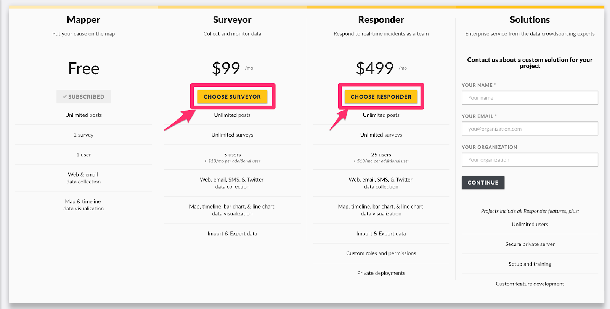

# 2.1 Upgrading/Downgrading your deployment plan

If you’re subscribed to one of our plans on ushahidi and would like to upgrade to another available plan:-

* Log into your deployment
* Click on _**Settings**_

* Click on _**Plan.**_
* On the list of all available plans, click on the one you would like to upgrade to e.g _**Choose Surveyor**_, or _**Choose Responder**_
* On selection of the plan you’d like to upgrade to, you’ll have to confirm your password before proceeding and click on continue.
* Enter your credit card details and click on continue
* After validation and successful payment, your deployment will be upgraded to your new plan in a couple of minutes!

_**NB:You can downgrade your deployment at any time by following the same process described above.**_

