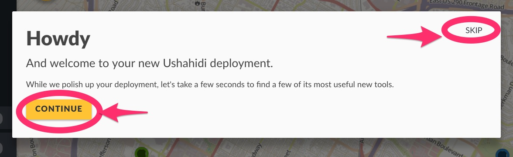

# 2. Setting up a deployment

You can create a new deployment in two ways:-

* From the homepage on [ushahidi.com](https://ushahidi.com)
* Or at [http://ushahidi.io/create](http://ushahidi.io/create)

* **Fill out your deployment details**:-
  * **Deployment Name:** You can give your deployment any name
  * **Deployment URL:** Each deployment will have a unique web address. No two deployments can have the same web address. Once created, this CANNOT be changed, so be sure to countercheck the web address set is one you’re okay having permanently.
  * Once you’re done, click on _**Continue**_.
* **Fill out your organization’s details**

* * **Organization name:** This is the name of your organization, assuming it's different from the name of your deployment
  * _**Size of the organization:**_ How many people are working with you in your organization?
  * _**What are you using Ushahidi for:**_ Select the appropriate category that matches what you will be using your deployment for
  * Once you’re done, click on _**Continue**_.
* **Fill out your account details**
  * **Name:** This will appear alongside your activity on the deployment
  * **Email address:** You’ll use this email address to log into your deployment and receive notifications
  * Set a secure password that will be used to access this deployment.
  * Agree to our [**Terms and Conditions**](https://www.ushahidi.com/terms-of-service)
* Once you’re done, click on “**Create Deployment**”
* You will be taken on a brief tour of the user interface and main features of Ushahidi. If you’d like to skip this tour, click on “Skip” at any time.

* After the tour, you will be prompted to choose a plan from a list. Select one of the options provided for you.

You can dive deeper into the [full list of plan features here](http://www.ushahidi.com/plans-detail.html) to help you choose a plan that will meet your needs. If you work for a grassroots organization that can’t afford a paid plan, [apply for a free Responder plan here](http://www.ushahidi.com/plans/apply-for-free).

* If you select the free Mapper plan, your deployment will build within a couple of minutes, and you’ll see your deployment name at the top.
* If you select a paid plan, e.g Surveyor or Responder, you’ll need to do the following:-
  * Enter your credit card details and click on continue
  * After validation and successful payment, your deployment will be set up and available for you to use in a couple of minutes.

