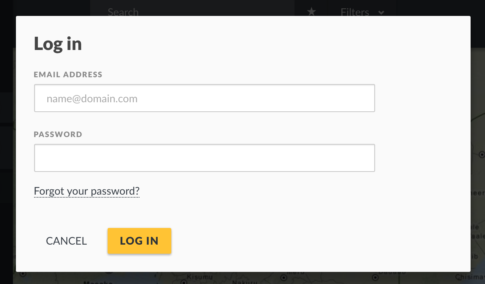
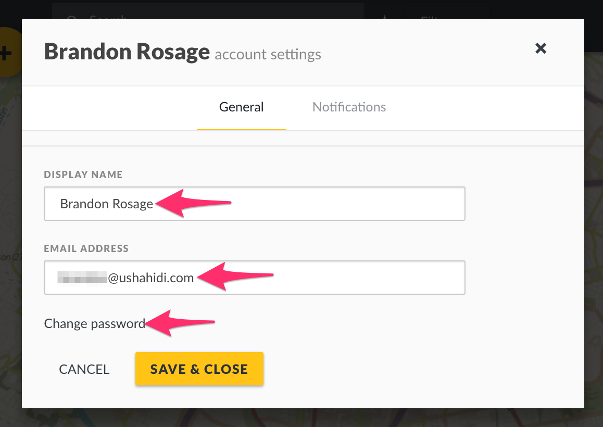

# 3.1 Accessing your deployment

## 3.1.1 Log in 

If your deployment website is [www.yourdomain.com](http://www.yourdomain.com), you should be able to login via [http://yourdomain.com/login](http://yourdomain.com/login), or by clicking on the _**Log in**_ link on the bottom left hand corner of your deployment as illustrated below.

* For Open Source deployments, the default install will create a user admin, with password admin. Be sure to edit this user’s password once you’re logged in.
* For ushahidi.io deployments, enter the email address and password you used to register your deployment, and the password

_**NB: You can use EITHER an email address OR username with a corresponding password to log into your deployment.**_

## 3.1.2 Create an account 

If you don’t have an account already, you can create one by clicking on _**Sign Up**_ and filling in the required details.

You’ll will be able to log in and perform basic actions on the platform, but won’t have much privilege within the platform until an administrator upgrades your access level.

### 3.1.2.1 Your Account details 

Once you’re logged in, you can access and change your account details at any time. To do so

* Click on your account favicon at the bottom left hand corner of your deployment as illustrated below.

* A pop up will appear on your screen. Make changes to your profile as desired, then click on _**Save & Close**_

### 3.1.2.2 Notifications 

As a registered and logged in user, you can set up notifications on [Saved Searches](../7.-analysing-data-on-your-deployment/7.1-saved-searches.md) and [Collections](../7.-analysing-data-on-your-deployment/7.2-collections.md). This means that any time a post is added to a saved search/collection, you will receive an email or phone notification.

You can manage\(turn these notification on or off\) by

* Clicking on your account favicon at the bottom left hand corner of your deployment as illustrated below.
* Clicking on _**Notifications**_

A list of all notifications you’ve signed up for will appear, with the option of turning them on and off. You’ll also be able to determine the email address or phone number through which you would like to receive notifications. You must have SMS configured to enable.

* You can also add additional contacts to receive notifications via email/phone.

## 3.1.3 Logging out 

To log out of your deployment,

* Click on the log out icon at the bottom left hand corner of your deployment as illustrated below.

* You should be successfully logged out of your deployment, and redirected to the homepage.

