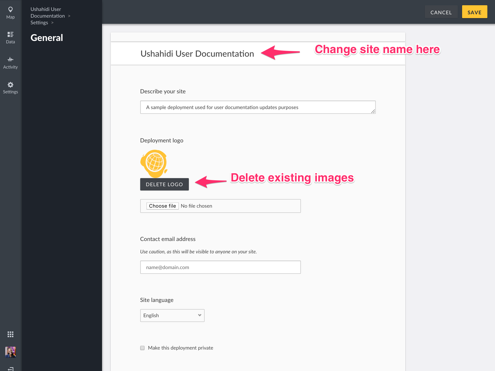

# 3.2 General Settings

This page allows you to set the basic appearance of your deployment. To access General Settings:-

* On the left hand menu bar, click on _**Settings**_

* Then, click on _**General Settings**_.

* Add the following details

* _**Site Name:**_ ****This changes the main title of your deployment, and is typically the title of your project. You can change this at any time.
* _**Site Description:**_ ****This tagline appears below your deployment name, and should be a one or two sentence overview of what your deployment is about.
* _**Deployment logo:**_ ****Your deployment logo will appear on the right hand sidebar on your homepage, under your deployment name and above your deployment description. If you’d like to remove it once it has been added, just hit the _**Delete Logo**_ button
* _**Contact Email Address:**_ ****This optional contact email will be displayed publicly to visitors of your deployment.
* _**Site Language:**_ ****You can update the default language of your deployment. This will update the labels within your user interface, and will update the layout of the deployment if you select a language that reads from the right to the left.
* _**Private deployment:**_ Ticking this checkbox makes your deployment and it’s data only accessible to registered users\(with the correct privileges\) on your deployment, who must sign in for access.
* _**Disable user sign up:**_ Ticking this checkbox disables the registeration feature preventing people from signing up into your deployment.
* _**API key:**_ This is used by developers who wish to integrate their tools with the Platform API. If you are not planning to do this, this should not affect you. To learn more about this, look at this [doc](https://docs.ushahidi.com/platform-developer-documentation/development-and-code/how-to-get-the-source-code#platform-api).

#### Configuring map settings

You’ll also need to configure your map settings from this page. Your map settings allow you to select the type of base map you want for your project\( the style your map will display as.

* _**Default base layer**_: Currently, the platform only offers Openstreetmap as a map provider. Plans are being made to add additional map providers.You can choose between the _map_, _satellite_ and _humanitarian_ views. This will determine the style your map will display as on your homepage.
* * _**Default latitude and Default longitude**_: Dragging and dropping the blue pointer on the map automatically fills in these two fields. In the event that you have lat/lon values, you can also type them in and the pointer on the map will automatically update to match the points entered.
  * _**Default zoom level**_: Zooming in and out of the map using the small menu bar on the left top hand side of the map will automatically set a value in this field. You may also optionally set the zoom level by manually adding a figure in this field and your map will update to match.
  * _**Combine nearby posts:**_ This checkbox is checked by default, meaning that posts near each other will be bundled together and denoted as a single point on the map with a number to show how many posts they are. If you uncheck this option, each post will appear as a single point on the map.
  * _**Map Precision Level :**_ This allows you to indicate the level of exactness for locations on the map.
* Click on _**Save**_ and refresh the page to ensure that your settings update.

