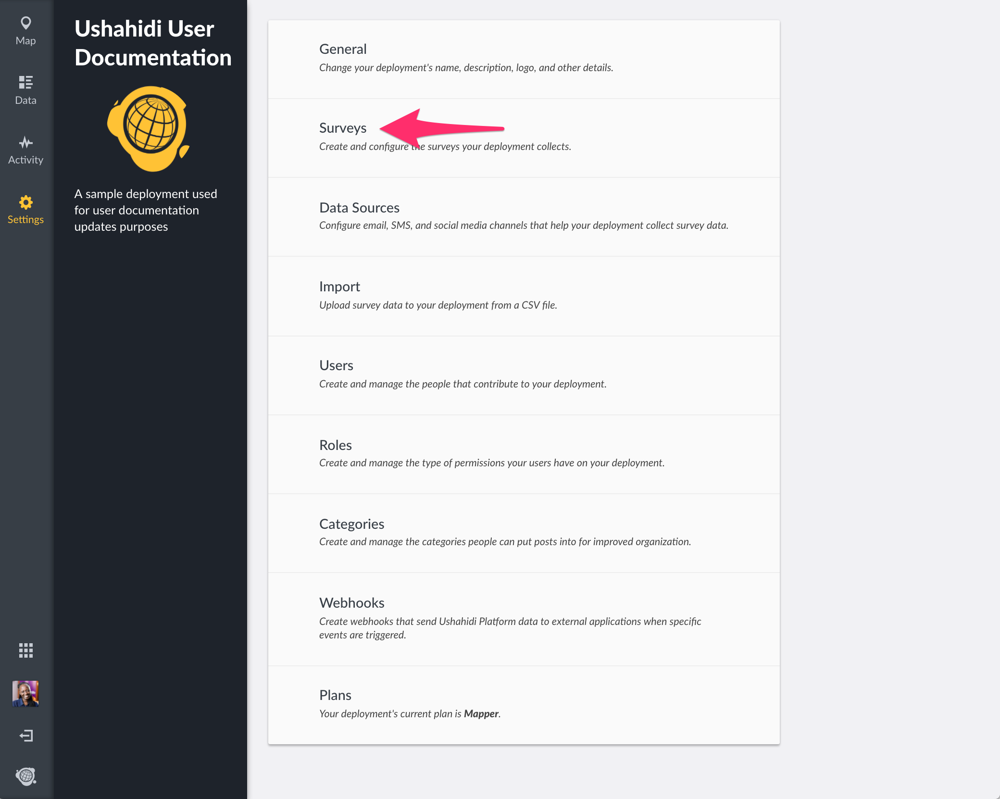
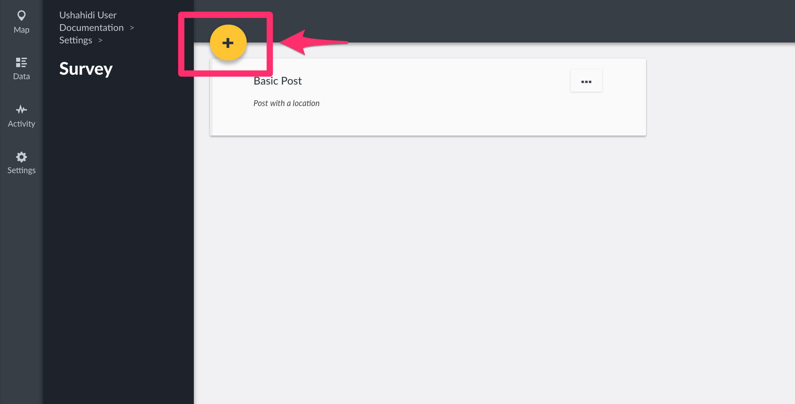
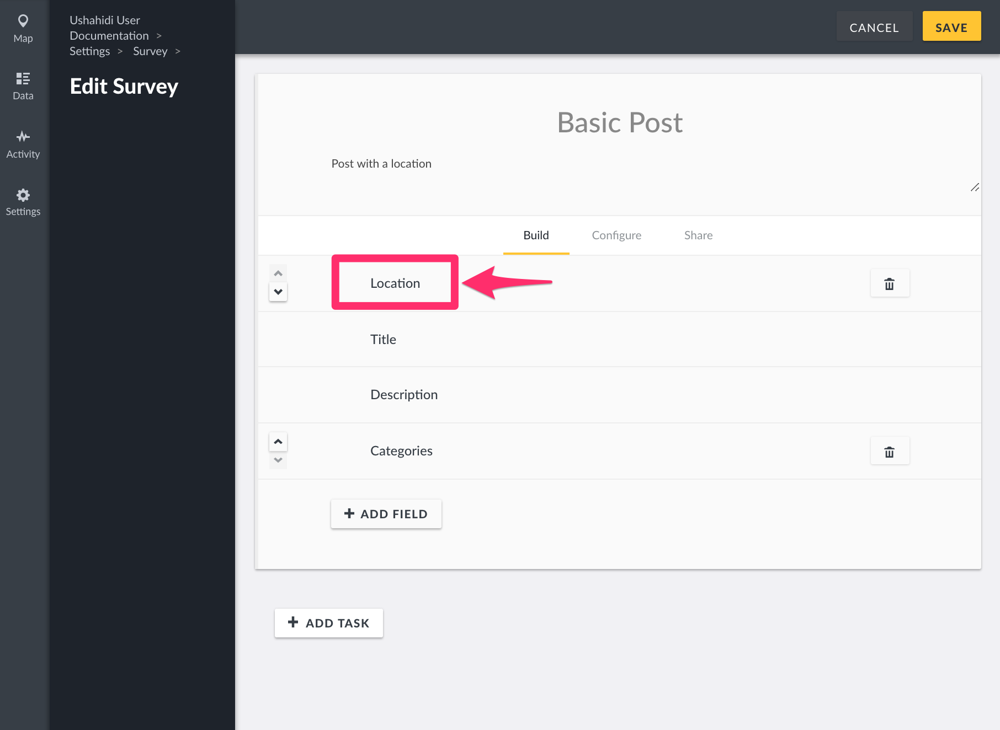
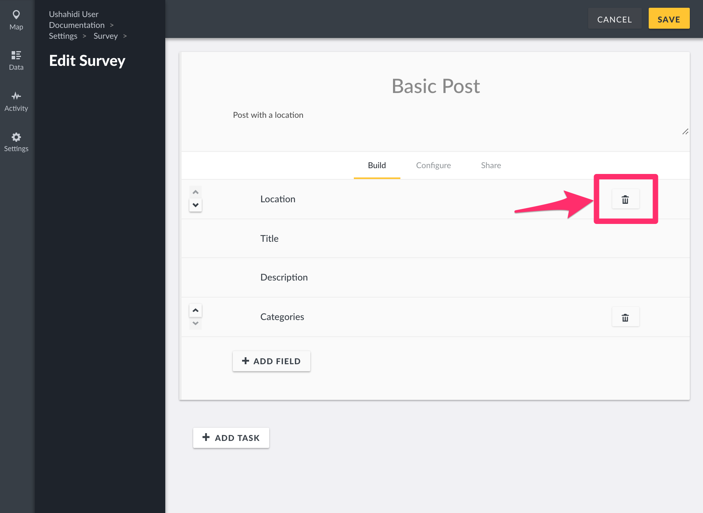
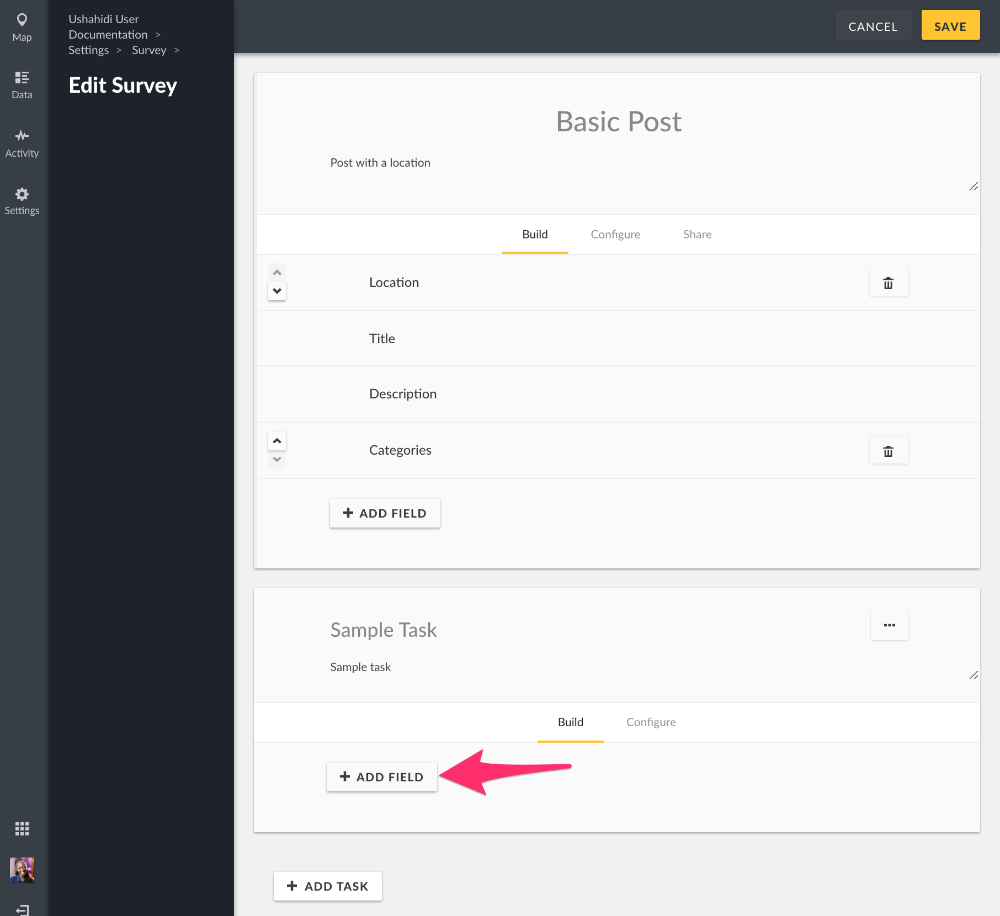
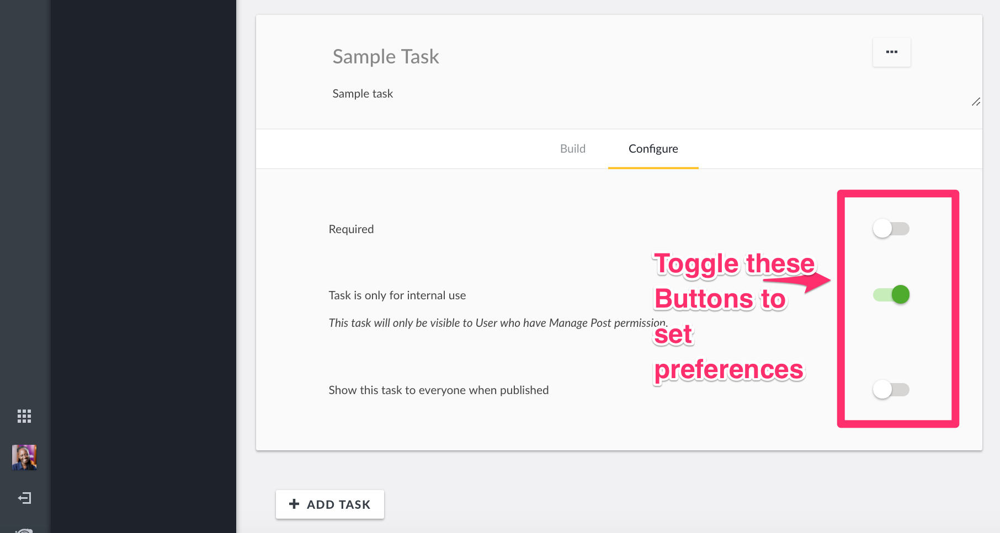
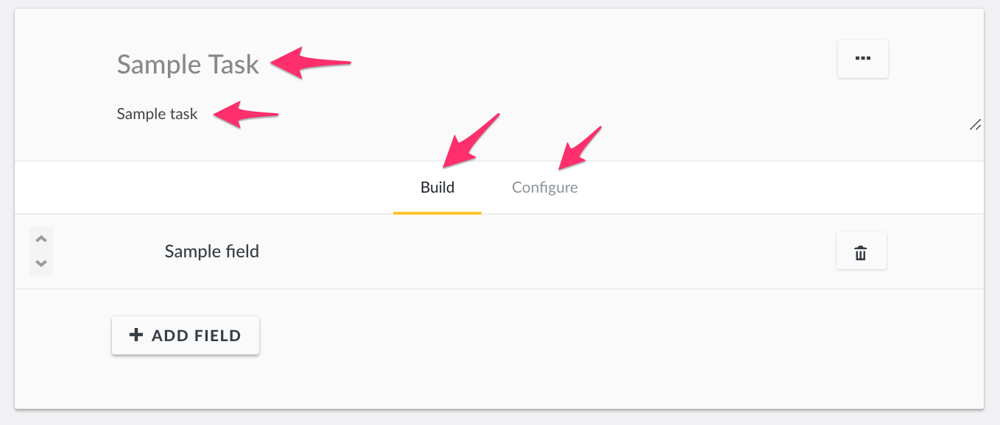
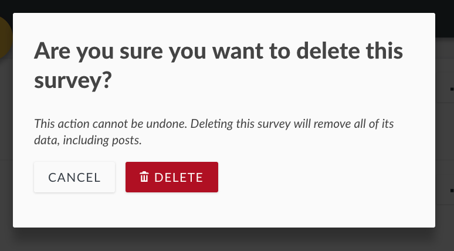

# 3.3 Surveys

If you’re someone who uses Ushahidi v2, _**Surveys**_ ****\(previously referred to as _**post types\)**_ in v3 are what we used to refer to as custom forms. A survey defines critical aspects of a post’s structure and permissions. For example, a post’s “survey” defines which fields are available for contributors to complete, and who can see it when it’s published.

This section will show you how to create and manage surveys on your deployment.

_**NB: If you’re a user on ushahidi.com, there are limits to the the number of surveys you can create, based on the Ushahidi plan you are subscribed to. You may review these from**_ ****[_**our plans page**_](https://www.ushahidi.com/plans)_**. For open source/self hosted deployments, you can create as many surveys as desired.**_

To access the Surveys configuration page,

* On the left hand menu bar, click on _**Settings**_
* Then, click on _**Surveys**_.

## 3.3.1 Building Surveys 

By default, each deployment has a _**Basic Post**_ ****survey, which can be deleted or modified as needed. To create a new survey,

* Click on the _**yellow icon**_ as shown below
* Fill in the required details.
  * _**Survey Name:**_ ****Try being as specific as possible when creating your survey name so that users will understand what they are selecting when creating new posts
  * _**Description:**_ ****Provide a brief description of what kind of data you’ll be collecting with this survey
  * _**Fields + Tasks:**_ See below for details on how to add fields and tasks into your survey.
* Click on save once you're done building your survey.

NB: If you're setting up multiple surveys with similar structures, here's a neat trick for you - you can duplicate your survey from the survey list page as follows :\).

### 3.3.1.1 Fields

Each survey you create will have a title and description field by default. It's important to note these fields can be edited, _**but cannot be deleted**_.

#### 3.3.1.1.1 Adding Fields

You can add as many custom fields to your survey as you see fit.To add a new field,

* Click on **Add Field**
* A pop up box with a list of different field types will appear on your screen. Choose whichever one will work best for the type of data you are trying to capture.
* Add the following details
  * _**Name:**_ This is what is displayed as a label for your newly created field
  * _**Show field description:**_ You may add help text that provides additional details about this field.
  * _**Required:**_ If set to yes, post submission will be only be successful once this field has been filled out. 
  * _**Make responses private**_: This allows limiting access to responses to this field to specific users.
  * _**Default Value:**_ You can set a default value displayed every time someone is creating a new post
  * _**Field Options:**_ This appears in cases where you’re creating a checkbox, select or radio button field. You can add as many options as you would like

Once you’re done, click on _**Add&Close.**_

#### 3.3.1.1.2 Editing Fields

To edit an existing field,

* Select the desired custom field by clicking on it
* Edit the fields\(as described in the section above on [Adding fields](3.3-surveys.md#33111-adding-fields)\) as desired.
* Click on _**Update&close**_ when done.

You can also change the position of existing fields by clicking on the scroll icons to the left of every field as shown below.

#### 3.3.1.1.3 Deleting Fields

To delete an existing field

* Click on the trash icon adjacent to the field you'd like to delete
* A pop up box will appear on the top of the page, prompting you to confirm whether you would like to delete the field
  * Click on _**Delete**_ to delete the field
  * If you’d like to cancel the field deletion process, click on Cancel

### 3.3.1.2 Tasks

You can organize your survey into “Tasks”, allowing a deployment to add fields related to actions that need to be taken, like translation or verification. These groups of tasks are visible to specified users and can be marked as ‘complete.’ For example, if a particular survey requires verification upon submission, you can design a task to ensure your team knows the post needs to be verified before publishing. The task could include fields like whether the information was verified or not, who verified the information, how they verified it, and when they verified it. After verification, the task can be marked as complete and the post can either be moved to the next task if necessary, or published.

#### 3.3.1.2.1 Building Tasks

To add a new task,

* Click on Add Task on your survey creation/edit page
* A small pop up box will appear, prompting you to give your task a name
* If you’d like to make this task required before post submission, toggle the _**Require this task be completed before a post can be visible to the public button**_. This means that, a post will not be published until this task is marked as complete
* Click on _**Add & Close**_

**Once set up, you can duplicate your task as follows.Adding task fields**

You should be able to add fields to tasks in the same way that you add fields to a survey.Please refer to the [Fields section](3.3-surveys.md#3311-fields) of this manual for details on how to add, edit and delete task fields.

#### 3.3.1.2.2 Configuring tasks

To make additional configurations to your task,

* Click on _**Configure**_
* Set the following options
  * \_**Required:** \_When set to yes, this task must be set as complete for successful post submission
  * _**Task is only for internal use:**_ This limits visibility of this task during submission only to teams with permissions to manage posts on your deployment i.e only internal team members will be able to submit responses to this task
  * \_**Show this task to everyone when published:** \_This limits visibility of task responses when viewing submitted posts if not enabled i.e it limits visibility of responses to tasks to internal teams only.

#### 3.3.1.2.3 Editing Tasks

To edit an existing task,

* Scroll down to the the desired task
* Make changes as desired, e.g changing the task name, description, and/or making a task required or not
* When done, click on _**Save**_ on the top of the page

#### 3.3.1.2.4 Deleting Tasks

To delete an existing task

* Scroll down to the desired task
* Click on the three dotted icon, and select _**Delete Task**_
* A pop up box will appear on the top of the page, prompting you to confirm whether you would like to delete the task
  * Click on _**delete**_ to delete the task
  * If you’d like to cancel the task deletion process, click on _**Cancel**_

## 3.3.2 Configuring Surveys

You can add additional configurations to your survey e.g setting a survey color etc. To do so,

* Click on _**Configure**_ on the top of the survey editor
* Configure the settings to suit your needs
* * _**Require posts be reviewed before they’re published:**_ ****When toggled on, posts submitted on your deployment will not be made public i.e accessible to anyone beyond your internal team, until it is reviewed \( It will remain in draft\). Setting this option off will automatically publish all posts submitted on your deployment. 
  * _**Hide author information:**_ ****When toggled on, this option hides author information e.g phone numbers, twitter handles and email addresses of people who submit posts to your deployment from the public. _Note: logged in users with the permission to manage posts will still be able to see author information._
  * \_**Who can add to this survey:**\_You can limit submission of posts to your survey by roles. By default, surveys are open to the general public for submissions, and not limited to internal roles. 
  * _**Color:**_ ****Select a color or input a specific hex value to choose which color will be associated with this survey. Pins on the map will match whichever color you select.
* Click on _**save**_ once your configuration options are complete

## 3.3.3 Sharing Surveys

Ushahidi provides the ability to _**Share**_ your survey across multiple platforms..

* _**Web address:**_ Copy and paste this link to direct people to your survey form
* _**Facebook:**_ ****Share the survey form on Facebook
* _**Twitter:**_ ****Share the survey form on Twitter
* _**Embed:**_ ****Copy and paste this HTML block of code to embed the survey form on any site across the web

## 3.3.4 Editing surveys 

To edit a survey

* Click on a survey from the list of surveys on your page
* From here, change your survey details as desired then click on _**Save**_

## 3.3.5 Deleting surveys 

To delete a survey,

* Select the desired survey from the surveys list page, and click on the three dots icon adjacent to it. Then, select _**delete**_
* A pop up box will appear on the top of the page, prompting you to confirm whether you would like to delete the survey
  * Click on **Delete** to delete the survey
  * If you’d like to cancel the survey deletion process, click on _**Cancel**_

