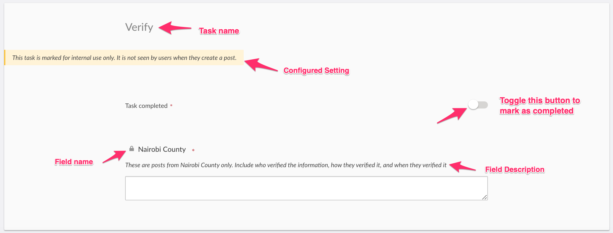
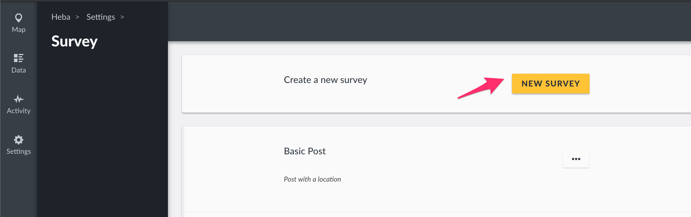
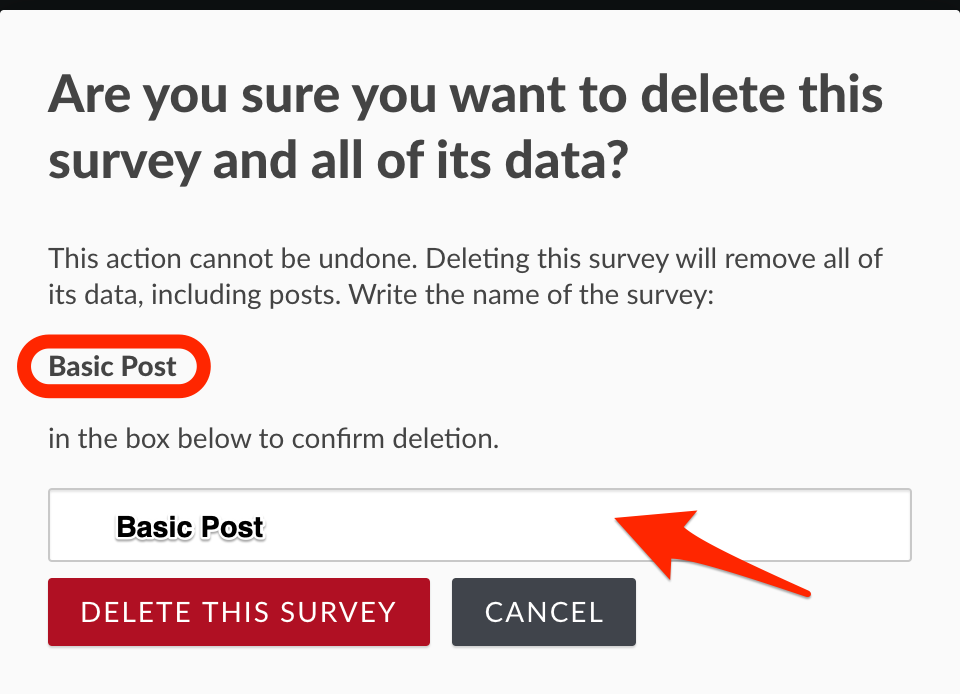

# 3.3 Surveys

If you’re someone who uses Ushahidi v2, _**Surveys**_ ****\(previously referred to as _**post types\)**_ in v3 are what we used to refer to as custom forms. A survey defines critical aspects of a post’s structure and permissions. For example, a post’s “survey” defines which fields are available for contributors to complete, and who can see it when it’s published.

This section will show you how to create and manage surveys on your deployment.

_**NB: If your deployment is hosted on ushahidi.com, usage limits may apply, based on the Ushahidi plan you are subscribed to. You may review these from**_ ****[_**our plans page**_](https://www.ushahidi.com/pricing)_**.**_ 

The setup in this guide is demonstrated in the below video as well. You can watch and follow the guide at the same time!

### Video setup guide for managing surveys



### Setup guide

To access the Surveys configuration page,

* On the left hand menu bar, click on _**Settings**_

* Then, click on _**Surveys**_.

## 3.3.1 Building Surveys 

By default, each deployment has a _**Basic Post**_ ****survey, which can be deleted or modified as needed. To create a new survey,

* Click on _**New Survey**_ as shown below.

* In the upper left corner of the survey form, you will see the default language that your deployment is currently in. Check [Chapter 3.3.2 ](https://docs.ushahidi.com/ushahidi-platform-user-manual/3.-configuring-your-deployment/3.3-surveys#3-3-2-configuring-surveys)**on how to change a survey's default language**
* Fill in the required details.

* _**Survey Name:**_ ****Try being as specific as possible when creating your survey name so that users will understand what they are selecting when creating new posts
* _**Description:**_ ****Provide a brief description of what kind of data you’ll be collecting with this survey
* _**Fields + Tasks:**_ See below for details on how to add fields and tasks into your survey.
* Click on _**save**_ once you're done building your survey.


See chapter 3.3.2 on how to translate your survey in other languages



If you're setting up multiple surveys with similar structures, here's a neat trick for you - you can duplicate your survey from the survey list page as follows


**To duplicate a survey:**

Click on the "..." context menu.

Click on the "Duplicate" link in the context menu to duplicate the survey.

### 3.3.1.1 Fields

#### Video setup guide for managing fields



Each survey you create will have a title and description field by default. It's important to note these fields can be edited, _**but cannot be deleted**_.

#### 3.3.1.1.1 Adding Fields

You can add as many custom fields to your survey as you see fit.To add a new field,

* Click on **Add Field**

* A pop up box with a list of different field types will appear on your screen. Choose whichever one will work best for the type of data you are trying to capture.

* Add the following details

  * _**Name:**_ This is what is displayed as a label for your newly created field
  * _**Add field description \(optional\):**_ A visual editor should appear below, you may add help text that provides additional details about this field.
    * Add some text in the description-editor, format it however you want to, and as long text as you want to.
  * _**Required:**_ If set to yes, post submission will be only be successful once this field has been filled out. If set to no, post submission will be successful even if it has not been filled out.
  * _**Make responses private**_: This allows limiting access to responses to this field to specific users.
  * _**Default Value:**_ You can set a default value displayed every time someone is creating a new post. example, a survey asks whether you want to subscribe to a service, and it has a default value of 'No'. If you submit without changing this value, the default value will be submitted as 'No' when you save the survey. If you change to 'Yes', the value that will be submitted will be 'Yes'. That's the value that will be submitted when the survey is saved.

  _**NB: For fields where it's possible to add a default value \(all field-types except "image", "description", "title" and "categories"\), the default value box should be displayed with no toggle-switch**_

  * _**Field Options:**_ This appears in cases where you’re creating a checkbox, select or radio button field. You can add as many options as you would like.

* Once you’re done, click on _**Add&Close.**_

_**Note that, the description should have the same formatting as it did in the field description editor.**_

To confirm this_**,**_add a new post to this survey,

* Save the post
* Go to data-view
* Select the post you added and select "edit"
* The field description you added will be visible.
* The description should have the same formatting as you did in the editor

#### 3.3.1.1.2 Editing Fields

To edit an existing field,

* Select the desired custom field by clicking on it

* Edit the fields \(as described in the section above on [Adding fields](3.3-surveys.md#33111-adding-fields)\) as desired.
* Click on _**Update&close**_ when done.

* You can also change the position of existing fields by clicking on the scroll icons to the left of every field as shown below.

#### 3.3.1.1.3 Deleting Fields

To delete an existing field

* Click on the trash icon adjacent to the field you'd like to delete

* A pop up box will appear on the top of the page, prompting you to confirm whether you would like to delete the field

  * Click on _**Delete**_ to delete the field
  * If you’d like to cancel the field deletion process, click on Cancel

### 3.3.1.2 Tasks

You can organize your survey into “Tasks”, allowing a deployment to add fields related to actions that need to be taken, like translation or verification. These groups of tasks are visible to specified users and can be marked as ‘complete.’ For example, if a particular survey requires verification upon submission, you can design a task to ensure your team knows the post needs to be verified before publishing. The task could include fields like whether the information was verified or not, who verified the information, how they verified it, and when they verified it. After verification, the task can be marked as complete and the post can either be moved to the next task if necessary, or published.

#### 3.3.1.2.1 Building Tasks

To add a new task,

* Click on Add Task on your survey creation/edit page

* A small pop up box will appear, prompting you to give your task a name
* If you’d like to make this task required before post submission, toggle the _**Require this task be completed before a post can be visible to the public button**_. This means that, a post will not be published until this task is marked as complete
* Click on _**Add & Close**_

**Once set up, you can duplicate your task as follows.Adding task fields**

You should be able to add fields to tasks in the same way that you add fields to a survey.

Please refer to the [Fields section](3.3-surveys.md#3311-fields) of this manual for details on how to add, edit and delete task fields.

#### 3.3.1.2.2 Configuring tasks

To make additional configurations to your task,

* Click on _**Configure**_

* Set the following options

* \_**Required:** \_When set to yes, this task must be set as complete for successful post submission
* _**Task is only for internal use:**_ This limits visibility of this task during submission only to teams with permissions to manage posts on your deployment i.e only internal team members will be able to submit responses to this task
* \_**Show this task to everyone when published:** \_This limits visibility of task responses when viewing submitted posts if not enabled i.e it limits visibility of responses to tasks to internal teams only.

#### 3.3.1.2.3 Editing Tasks

To edit an existing task,

* Scroll down to the the desired task
* Make changes as desired, e.g changing the task name, description, and/or making a task required or not

* When done, click on _**Save**_ on the top of the page

#### 3.3.1.2.4 Deleting Tasks

To delete an existing task

* Scroll down to the desired task
* Click on the three dotted icon, and select _**Delete Task**_
* A pop up box will appear on the top of the page, prompting you to confirm whether you would like to delete the task

  * Click on _**delete**_ to delete the task
  * If you’d like to cancel the task deletion process, click on _**Cancel**_

  _\*\*\*\*_

## 3.3.2 Translating Surveys

Once the survey form has been created and all the required fields have been filled, you can translate the survey into other languages if you want to. Below are a video and written setup guides to help you.

**Nb: You can add more than one language**

#### Video Setup Guide



#### Written Setup Guide

* Click on _**+Add translation**_ at the upper right-hand corner of the survey form.

* A pop-up module will appear on your screen, click on the dropdown menu, and select the language you want to translate to.

* Click on Add to finish.
* You will be redirected to a survey form with the translatable content in the default language and fields where you can add your translations

* On the empty fields, translate the survey details into the chosen language e.g in the above image the default language is English and the added language is French.

### 3.3.2.1 **Translating Fields**

To translate the added fields on your survey;

* Scroll down to fields.
* Select the desired custom field by clicking on it.

* A pop-up module will appear. Translate the field details to the chosen language.

Translate the remaining fields that you added.

### **3.3.2.2 Translating Tasks**

To translate tasks;

* Scroll down to tasks.

* Translate the task details.

You should be able to translate the task fields in the same way that you translated the fields in the surveys. _**Please refer to the Fields section of this manual for details on how to translate task fields.**_

* Click Save when all is done.

On the survey, you will see the available languages that the survey has been translated into.

## 3.3.3 Configuring Surveys

You can add additional configurations to your survey e.g setting a survey color etc. To do so,

* Click on _**Configure**_ on the top of the survey editor

* Configure the settings to suit your needs

* _**Note: logged in users with permission to manage posts will still be able to see         author information.**_
  _**Note: logged in users with permission to manage posts will still be able to see         author information.**_

  * _**Hide exact location information:**_  When toggled on, this option hides the exact location of posts on the map. Only the people with the permission to edit will be able to see exact locations, those without permission will only able to see rounded locations. The locations will be accurate to 0.1 km.
  * _**Hide exact time information:**_ When toggled on, only people with permission to edit responses will be able to see exact time submitted. Other people will see only the date.
  * \_**Who can add to this survey:**\_You can limit submission of posts to your survey by roles. By default, surveys are open to the general public for submissions, and not limited to internal roles. 
  * _**Color:**_ ****Select a color or input a specific hex value to choose which color will be associated with this survey. Pins on the map will match whichever color you select.
  * **Select default language for this survey:** Click on the dropdown menu to choose the default language. This will be changing the language of the deployment that is currently in.

* Click on _**save**_ once your configuration options are complete

## 3.3.4 Sharing Surveys

Ushahidi provides the ability to _**Share**_ your survey across multiple platforms..

* _**Web address:**_ Copy and paste this link to direct people to your survey form
* _**Facebook:**_ ****Share the survey form on Facebook
* _**Twitter:**_ ****Share the survey form on Twitter
* _**Embed:**_ ****Copy and paste this HTML block of code to embed the survey form on any site across the web

## 3.3.5 Editing surveys 

To edit a survey

* Click on a survey from the list of surveys on your page.
* From here, change your survey details as desired then click on _**Save.**_

## 3.3.6 Deleting surveys 

To delete a survey,

* Select the desired survey from the surveys list page, and click on the three dots icon adjacent to it. Then, select _**delete.**_

* A pop up box will appear on the top of the page, prompting you to confirm whether you would like to delete the survey and all its data.
  * Enter the name of your survey in the text box.
  * Click on **Delete this survey** to delete the survey
  * If you’d like to cancel the survey deletion process, click on _**Cancel.**_

_**Nb: Once you delete your survey all its data and posts will be deleted . This cannot be undone, so take caution when you perform this action.**_

