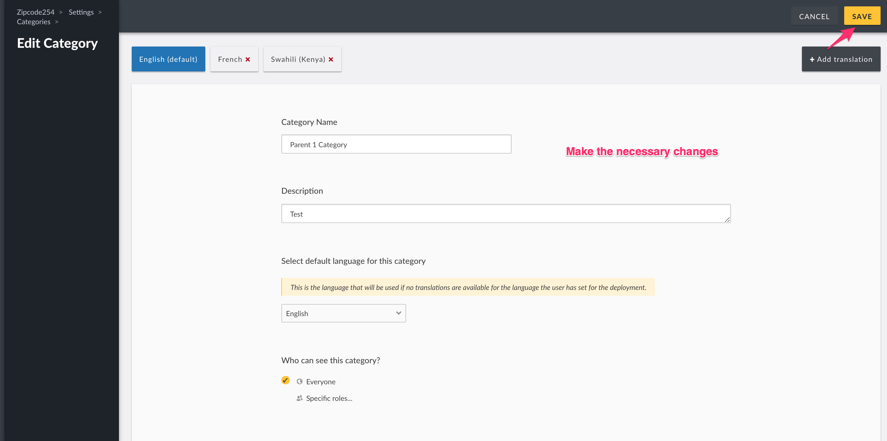
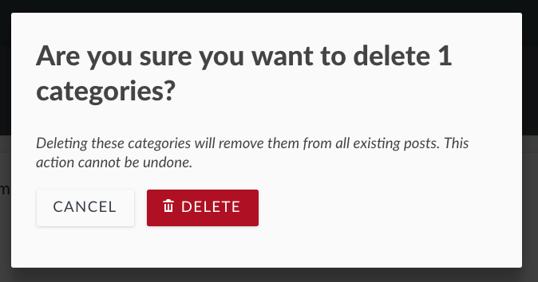

# 3.5 Categories

Categories are a way of grouping your posts based on their content within a Survey.

The setup in this guide is demonstrated in the below video as well. You can watch and follow the guide at the same time!

### Video setup guide



### Setup Guide

To access the Categories configuration page,

* On the left hand menu bar, click on _**Settings**_

* Then, click on _**Categories**_.

* You’ll be redirected to a page where you can manage categories on your deployment

## 3.5.1 Adding and Configuring Categories 

Unlike Ushahidi v2.x, your deployment **DOES NOT** come with pre installed/set-up categories. You will need to create this on your new Ushahidi deployment. Categories are now treated as custom fields within a Survey. This gives you the flexibility to add certain categories to some surveys, but not others.

There are two ways to create new categories. First, navigate to _**Settings → Categories**_

* Click on the _**Add Category icon as shown below**_

* In the upper left corner of the category page, you will see the default language that your deployment is currently in. 

* Add the following details
  * _**Category Name:**_ ****Give your category a name that will appear on your homepage and when users are creating new posts.
  * _**Description:**_ ****You can provide a brief description of what kind of information you will fall under this category
  * _**Child / parent settings**_: You can choose to set any category as a “child” to another, creating a hierarchy within the categories themselves, and will reflect this in their positioning on the sidebar.
  * **Default language:** Click on the drop down menu  to select your preferred default language
  * _**Roles**_: You can opt to set your category as visible to specific user roles on your deployment here. This list is populated based on custom roles created. More on [Roles here](../4.-managing-people-on-your-deployment/4.1-roles.md). 

Once that is done, you can translate the category into other languages.

To do that;

* Click on _**+ Add** **translation**_ at the upper right-hand corner of the screen.
* A pop-up module will appear on your screen, click on the dropdown menu, and select the language you want to translate to.

* Click on Add to finish.
* You will be redirected to a page with the translatable content in the default language and fields where you can add your translations.

* On the empty fields, translate the category name and description details into the chosen language e.g in the above image the default language is English and the added language is Swahili.
* Click Save when all is done to create the category. You can now choose to add this category to any of your Surveys.
* Under the category name, you will see the available languages the category has been translated into.

  
****Add categories as custom fields as you build and edit Surveys. First, navigate to **Settings → Surveys,** and either select the already existing Survey you’d like to edit, or create a new Survey.

* Click on _**Add field**_ at the bottom of the survey builder and select \_**Categories** \_from the list of field options 

* Configure the following:
  * _**Name:**_ ****Name or prompt for your survey field
  * _**Show field description:**_ ****Turn this on if you’d like to add a short description or help text to the field
  * _**Which labels should be available:**_ ****Select which categories you’d like to add to the field as options

* Click _**Add & Close**_ ****to save your new categories field
* It will now appear as a custom field with the appropriate categories on your Survey form

## 3.5.2 Editing Categories 

To edit a category,

* Click on the desired category from the category list page

You’ll get redirected to the _**Edit Category**_ page, where you should be able to add/edit details as described in the [adding categories section](3.5-categories.md#3-5-1-adding-and-configuring-categories) above.

* When done, click on _**Save**_, and your changes will reflect shortly.

## 3.5.3 Deleting Categories 

You can delete one or multiple categories at a time.

#### Deleting a category from the category list page

To delete a single category, select the trash icon adjacent to the category.

#### **To delete multiple categories:**

* Tick the checkbox on the left, adjacent to the category/categories you would like to delete from the category list page
* This action will activate the previously inactive _**Delete**_ button on top left hand corner of the page. Click on this button to initiate deletion.

#### Deleting a category from the category edit page:

* Click on the _**Delete Category**_ button

* A pop up box will appear on the top of the page, prompting you to confirm whether you would like to delete the category/categories
  * Click on _**Delete**_ to delete your category/categories
  * If you’d like to cancel the category deletion process, click on _**Cancel**_

