## 3.3 Surveys {#3-3-surveys}

If you’re someone who uses Ushahidi v2, **_Surveys_ **(previously referred to as **_post types)_** in v3 are what we used to refer to as custom forms. A survey defines critical aspects of a post’s structure and permissions. For example, a post’s “survey” defines which fields are available for contributors to complete, and who can see it when it’s published.

This section will show you how to create and manage surveys on your deployment.

**_NB: If you’re a user on ushahidi.com, there are limits to the the number of surveys you can create, based on the Ushahidi plan you are subscribed to. You may review these from_ **[**_our plans page_**](https://www.ushahidi.com/plans)**_. For open source/self hosted deployments, you can create as many surveys as desired._**

To access the Surveys configuration page,

*   On the left hand menu bar, click on **_Settings_**

*   Then, click on **_Surveys_**.

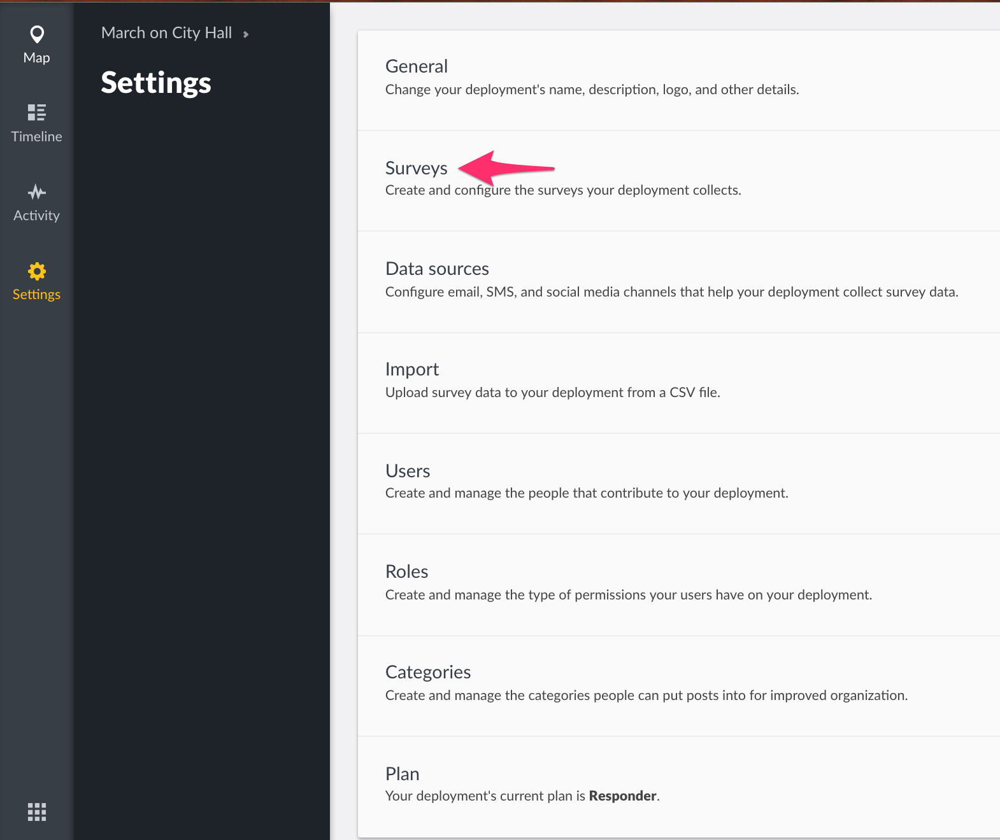

### 3.3.1 Adding Surveys {#3-3-1-adding-surveys}

By default, each deployment has a **_Basic Post_ **survey, which can be deleted or modified as needed. To create a new survey,

*   Click on the **_yellow icon_** as shown below

*   Fill in the required details. 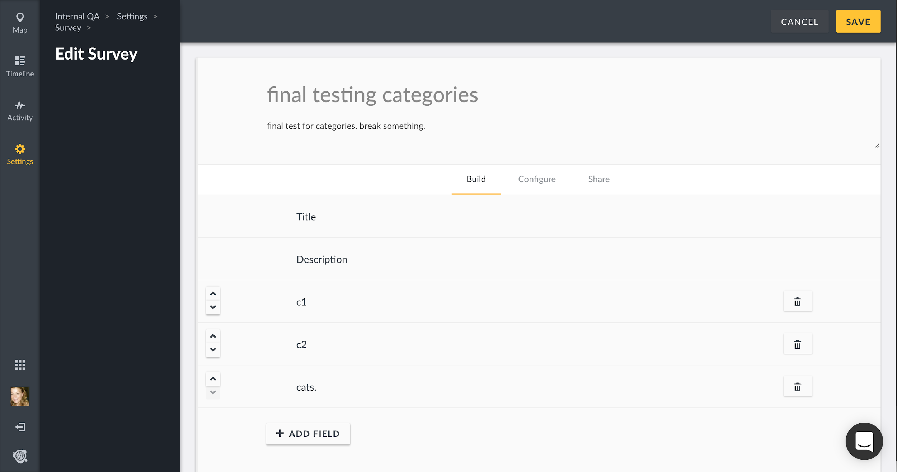
    *   **_Survey Name:_ **Try being as specific as possible when creating your survey name so that users will understand what they are selecting when creating new posts
    *   **_Description:_ **Provide a brief description of what kind of data you’ll be collecting with this survey
    *   **_Tasks_**: This section allows you to break out your survey into specific tasks with fields, as described in

        Section 3.3.1.1

        below.
*   Click on **_Save_** when done.

#### 3.3.1.1 Building your Survey {#3-3-1-1-building-your-survey}

Each survey you create will have a title and description field by default. You can add as many custom fields to your survey as you see fit.

3.3.1.1.1 Adding Fields

To add a new field,

*   Click on **_Add Field_**

**_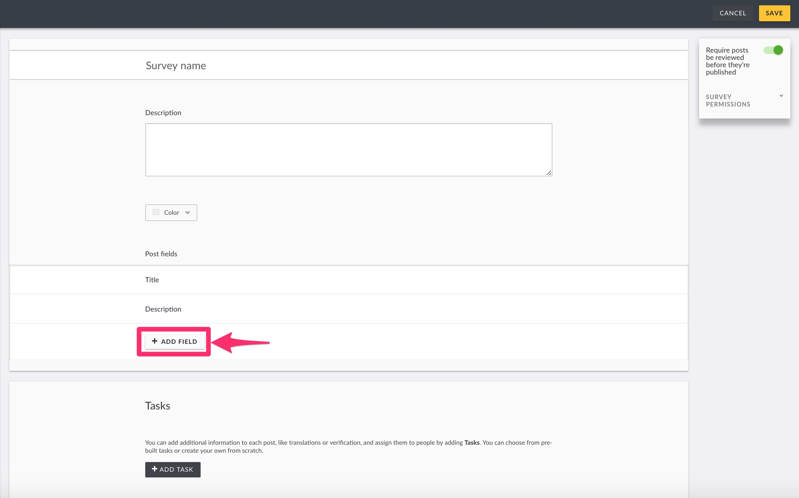_**

*   A pop up box with a list of different field types will appear on your screen. Choose whichever one will work best for the type of data you are trying to capture.

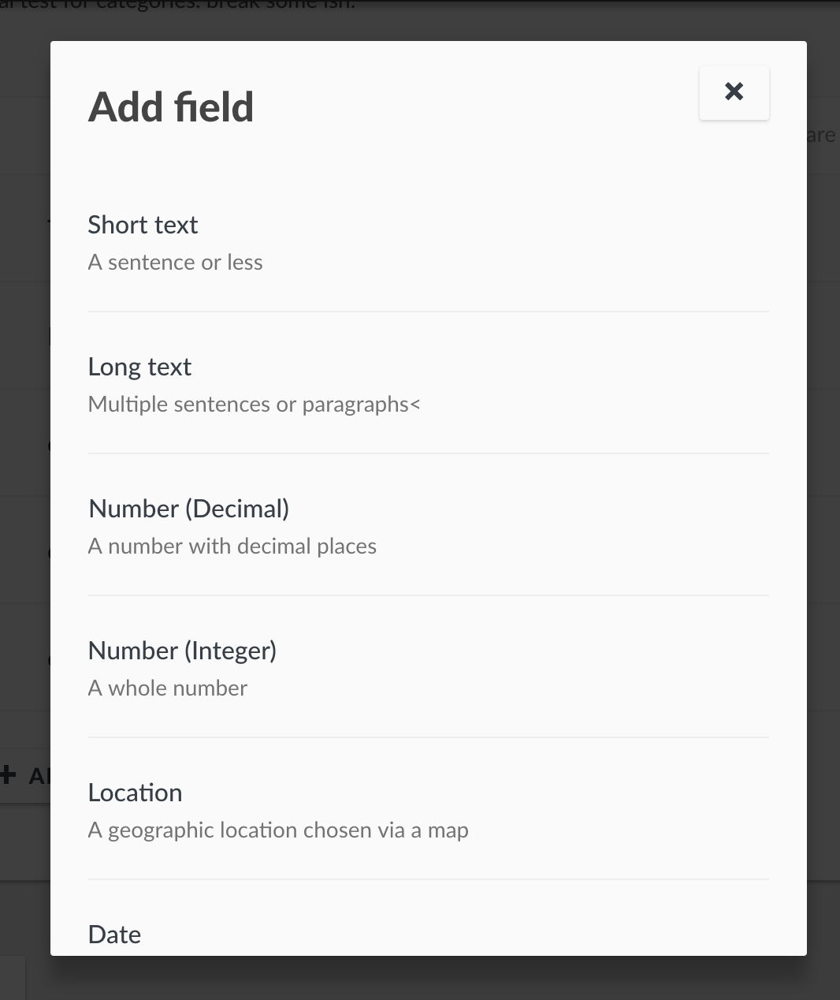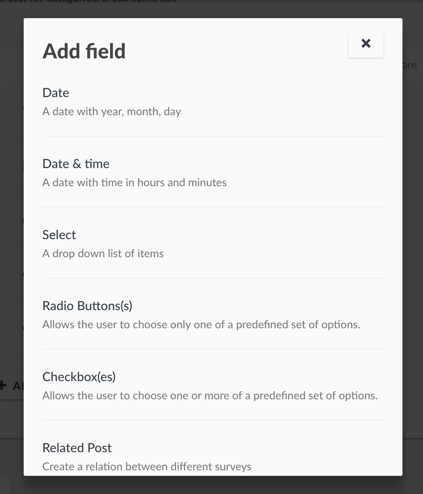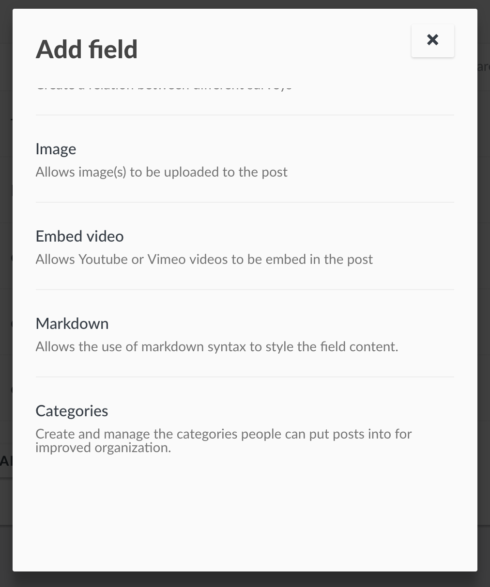

*   Add the following details
    *   **_Name_**: This is what is displayed as a label for your newly created field.
    *   **_Show field description:_ **Turn this on if you’d like to add a short description or help text to the field.
    *   **_Field Options_**: This appears in cases where you’re creating a checkbox, select or radio button field. You can add as many options as you would like.
    *   **_Required_**: If set to yes by toggling the button, the post to which this field belongs will not be able to be submitted for review or published until this field has been filled out.
    *   **_Make responses private:_ **If set to yes by toggling the button, the information input into this field will only be visible by the user roles with permission to manage posts. The information will not be made visible to anyone else.
    *   **_Default Value_**: You can set a default value displayed every time someone is creating a new post.

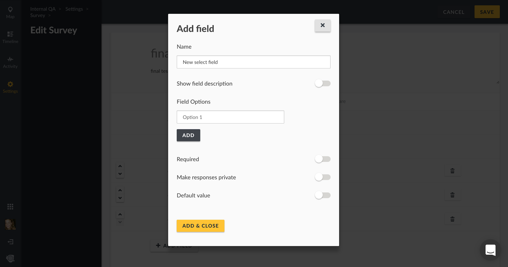

*   Once you’re done, click on **_Add&amp;Close_**.

3.3.1.1.2 Editing Fields

To edit an existing field,

*   Select the desired custom field by clicking on it

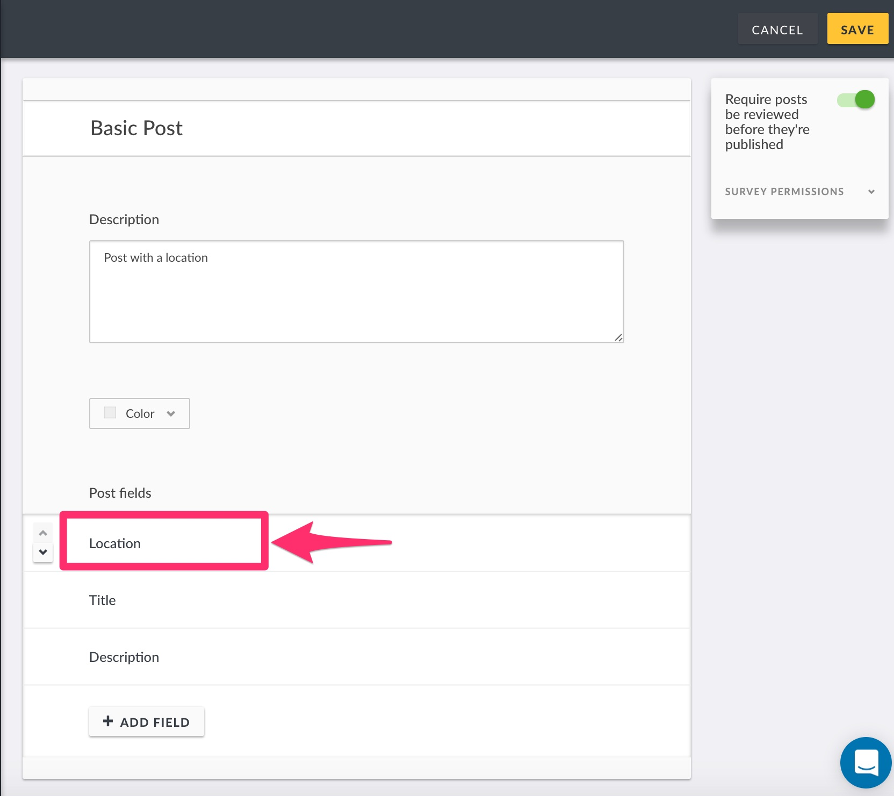

*   Edit the fields(as described in the section above on Adding fields) as desired.
*   Click on **_Update&amp;close_ **when done.

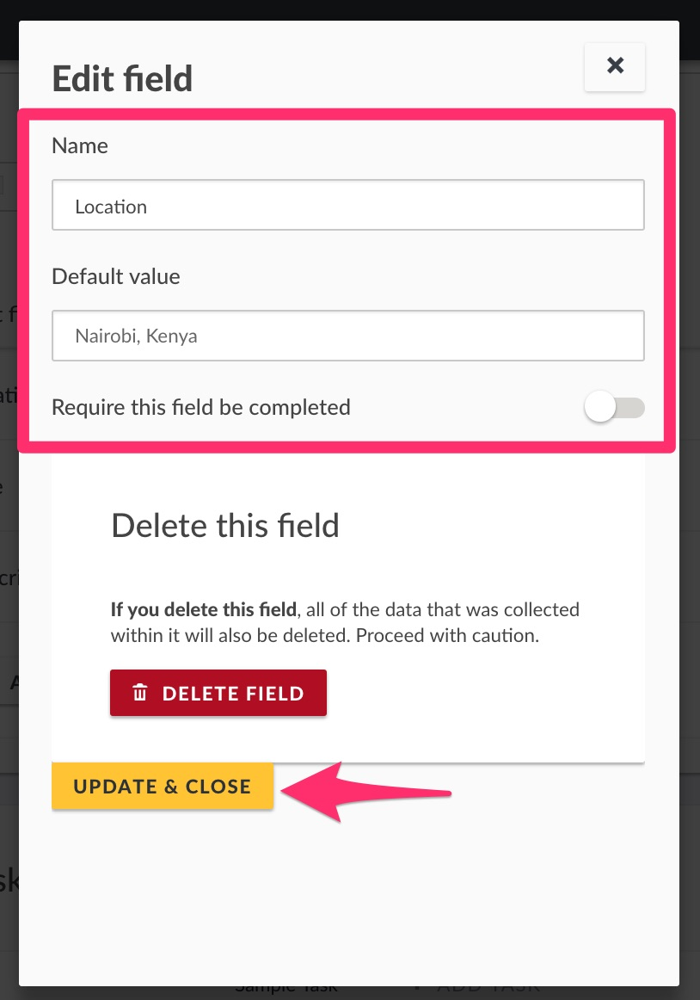

You can also change the position of existing fields by clicking on the scroll icons to the left of every field as shown below.

3.3.1.1.3 Deleting Fields

To delete an existing field

*   Click on the field you would like to delete(as you would when selecting a field to edit), then click on **_Delete Field_**

**_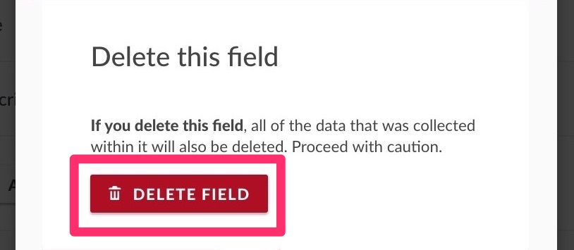_**

*   A black pop up box will appear on the top of the page, prompting you to confirm whether you would like to delete the field
    *   Click on **_Delete_** to delete the field
    *   If you’d like to cancel the field deletion process, click on **_Cancel_**

#### 

####  {#-0}

#### 3.3.1.2 Tasks {#3-3-1-2-tasks}

You can organize your survey into “Tasks”, allowing a deployment to add fields related to actions that need to be taken, like translation or verification. These groups of tasks are visible to specified users and can be marked as ‘complete.’ For example, if a particular survey requires verification upon submission, you can design a task to ensure your team knows the post needs to be verified before publishing. The task could include fields like whether the information was verified or not, who verified the information, how they verified it, and when they verified it. After verification, the task can be marked as complete and the post can either be moved to the next task if necessary, or published.

3.3.1.2.1 Adding Tasks

To add a new task,

*   Click on **_Add Task_ **on your survey creation/edit page

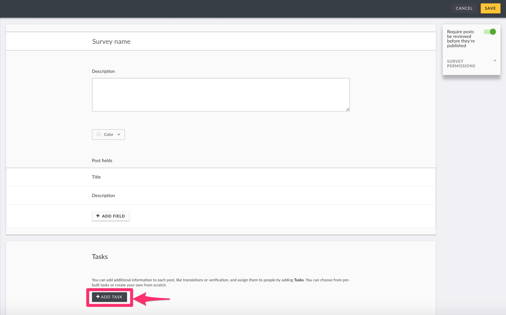

*   A small pop up box will appear, prompting you to give your task a name
*   If you’d like to make this task required before post submission, toggle the **_Require this task be completed before a post can be visible to the public_ **button. This means that, a post will not be published until this task is marked as complete
*   Click on **_Add &amp; Close_**

**_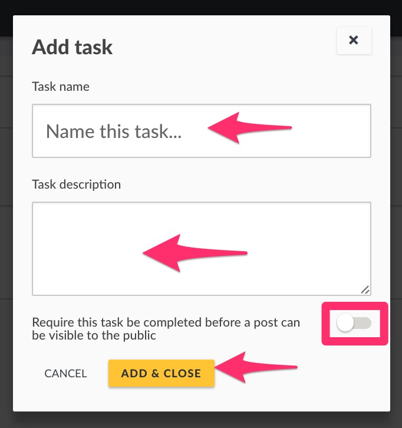_**

Adding task fields

You should be able to add fields to tasks in the same way that you add fields to a survey.

Please refer to the [Fields section](#3-3-1-1-building-your-survey) of this manual for details on how to add, edit and delete task fields.

3.3.1.2.2 Editing Tasks

To edit an existing task,

*   Select the desired task
*   Make changes as desired, e.g changing the task name, description, and/or making a task required or not

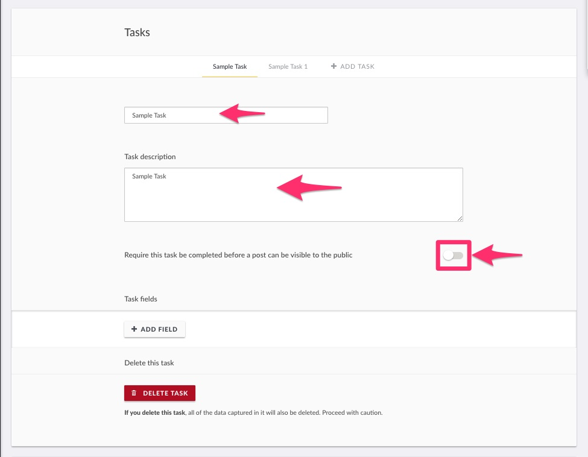

*   When done, click on **_Save_ **on the top of the page

3.3.1.2.3 Deleting Tasks

To delete an existing task

*   Select the desired task

*   Click on **_Delete Task_**

****

*   A black pop up box will appear on the top of the page, prompting you to confirm whether you would like to delete the task
    *   Click on **_OK_** to delete the task
    *   If you’d like to cancel the task deletion process, click on **_Cancel_**

****

3.3.1.2.4 Configuring Surveys

After you build a Survey, you’ll need to **_Configure_** the survey’s settings.

*   Click on **_Configure_** on the top of the survey editor
*   Configure the settings to suit your needs

*   *   **_Require posts be reviewed before they’re published:_ **Toggle this option “on” if you’d like posts to remain as drafts until you or a member of your team review the post’s information and choose to publish them. If this is toggled “off”, posts submitted to this survey will be published to everyone immediately after submission.
    *   **_Hide author information:_ **Toggle this option “on” if you’d like to completely hide any author information publicly. _Note: logged in users with the permission to manage posts will still be able to see author information._
    *   **_Who can add to this survey:_ **Choose whether everyone or only specific roles can add to this particular survey.
    *   **_Color:_ **Select a color or input a specific hex value to choose which color will be associated with this survey. Pins on the map will match whichever color you select.

3.3.1.2.4 Sharing Surveys

After you build and configure a Survey, you can choose to **_Share_** the survey.

*   **_Web address:_** Copy and paste this link to direct people to your survey form
*   **_Facebook:_ **Share the survey form on Facebook
*   **_Twitter:_ **Share the survey form on Twitter
*   **_Embed:_ **Copy and paste this HTML block of code to embed the survey form on any site across the web

### 3.3.2 Editing surveys {#3-3-2-editing-surveys}

To edit a survey

*   Click on a survey from the list of surveys on your page

*   From here, change your survey details as desired then click on **_Save_**

### 3.3.3 Deleting surveys {#3-3-3-deleting-surveys}

To delete a survey,

*   Select the desired survey from the surveys list page

*   Click on **_Delete Survey_**

****

*   A black pop up box will appear on the top of the page, prompting you to confirm whether you would like to delete the survey
    *   Click on **_OK_** to delete the survey
    *   If you’d like to cancel the survey deletion process, click on **_Dismiss_**