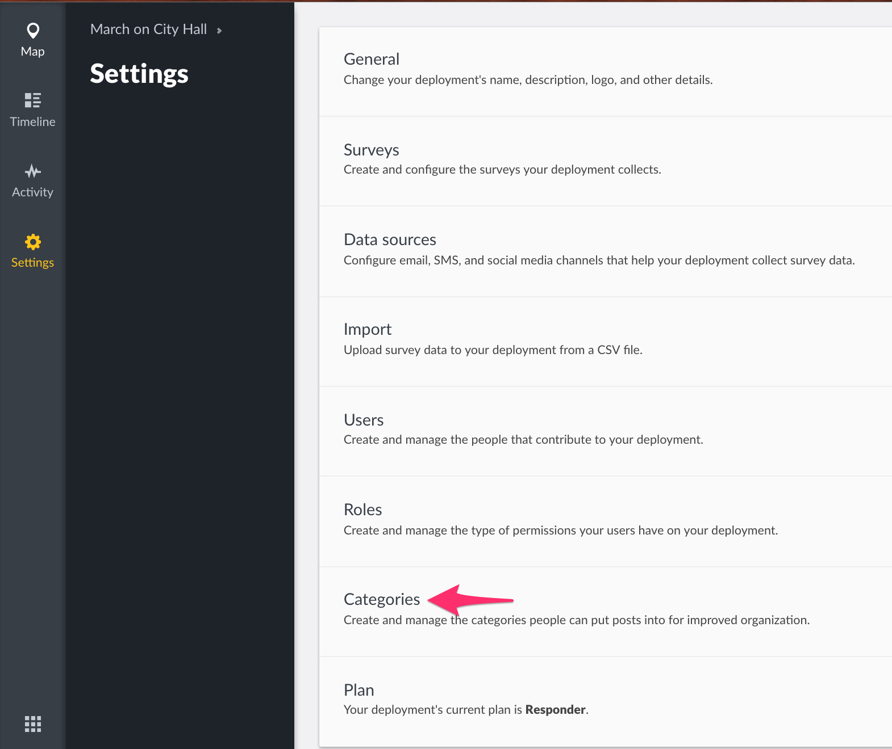
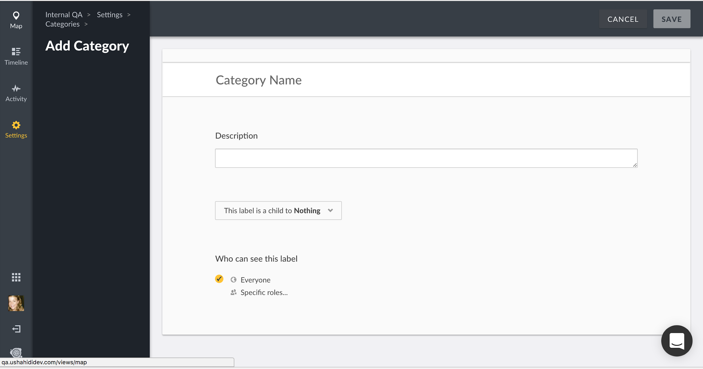
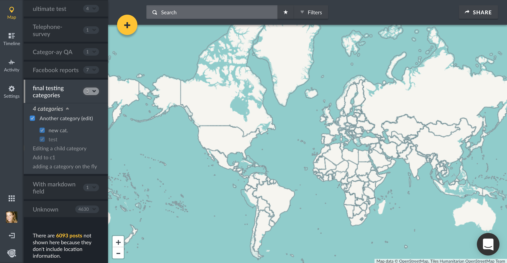
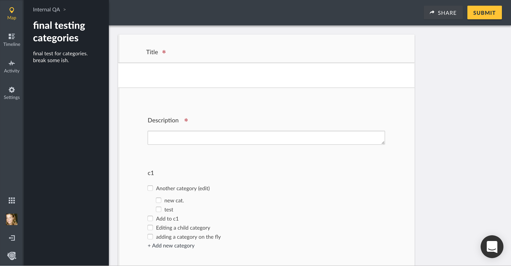
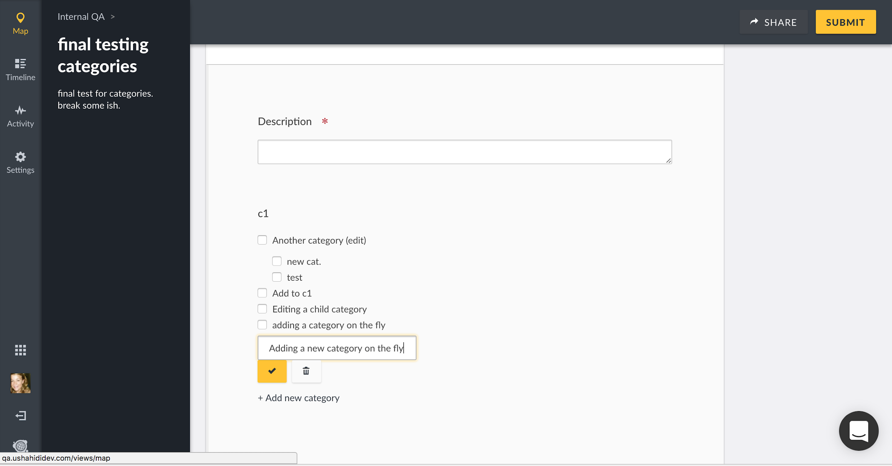
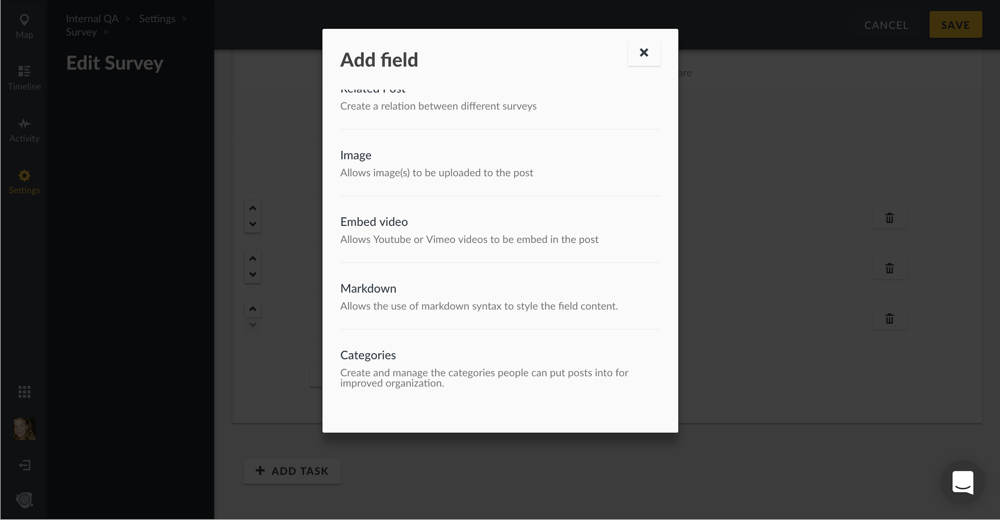
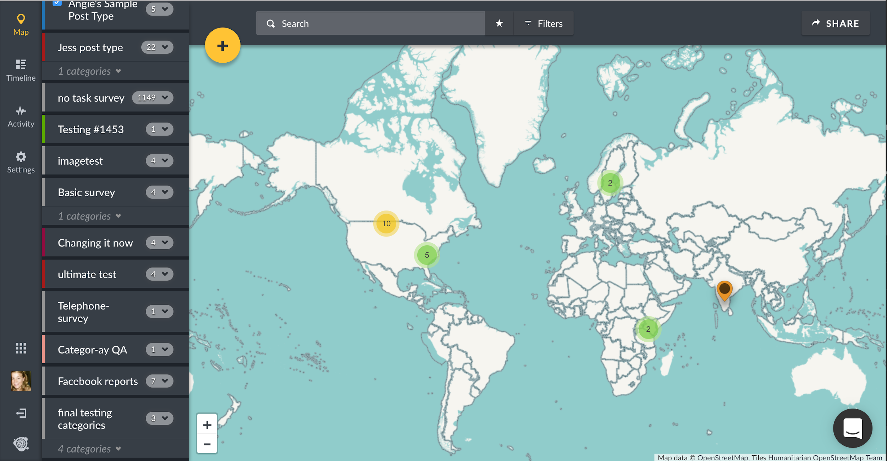

## 3.5 Categories {#3-5-categories}

Categories are a way of grouping your posts based on their content within a Survey.

To access the Categories configuration page,

*   On the left hand menu bar, click on **_Settings_**

*   Then, click on **_Categories_**.

*   You’ll be redirected to a page where you can manage categories on your deployment

### 3.5.1 Adding and Configuring Categories {#3-5-1-adding-and-configuring-categories}

Unlike Ushahidi v2.x, your deployment DOES NOT come with pre installed/set-up categories. You will need to create this on your new Ushahidi deployment. Categories are now treated as custom fields within a Survey. This gives you the flexibility to add certain categories to some surveys, but not others.

There are two ways to create new categories. First, navigate to **_Settings → Categories_**

*   Click on the **_Add Category icon as shown below_**

****

*   Add the following details
    *   **_Category Name:_ **Give your category a name that will appear on your homepage and when users are creating new posts.
    *   **_Description:_ **You can provide a brief description of what kind of information you will fall under this category
    *   **_Roles_**: You can opt to set your category as visible to specific user roles on your deployment here. This list is populated based on custom roles created. More on Roles in [section 4.1](../4_managing_people_on_your_deployment/41_roles.md) of this manual
    *   **_Child / parent settings_**: You can choose to set any category as a “child” to another, creating a hierarchy within the categories themselves, and will reflect this in their positioning on the sidebar.

*   Click on **_Save_** to create the category. You can now choose to add this category to any of your Surveys.

You can also create categories on the fly within the survey form itself

*   Navigate to a Survey form that already has a categories field
*   Under the categories field, you will see an option to **_Add new category_**. Click this.

*   Type the name of the new category you’d like to add

*   Click the yellow check mark to save your new category, or click the trash can icon to cancel the new category creation
*   To edit or manage your category and its settings, navigate to **Settings → Categories**

Add categories as custom fields as you build and edit Surveys. First, navigate to **Settings → Surveys,** and either select the already existing Survey you’d like to edit, or create a new Survey.

*   Click on **_Add field_** at the bottom of the survey builder and select **_Categories_**from the list of field options 
*   Configure the following:
    *   **_Name:_ **Name or prompt for your survey field
    *   **_Show field description:_ **Turn this on if you’d like to add a short description or help text to the field
    *   **_Which labels should be available:_ **Select which categories you’d like to add to the field as options

*   Click **_Add &amp; Close_ **to save your new categories field
*   It will now appear as a custom field with the appropriate categories on your Survey form

The categories you selected will also appear in the left side context modal as filtering options

### 3.5.2 Editing Categories {#3-5-2-editing-categories}

To edit a category,

*   Click on the desired category from the category list page

*   You’ll get redirected to the **_Edit Category_** page, where you should be able to add/edit details as described in [section 3.6.1](#3-5-1-adding-and-configuring-categories) above.
*   When done, click on **_Save_**, and your changes will reflect shortly.

### 3.5.3 Deleting Categories {#3-5-3-deleting-categories}

You can delete one or multiple categories at a time.

To delete a category,

*   From the category list page,
    *   Tick the checkbox on the left, adjacent to the category/categories you would like to delete from the category list page
    *   This action will activate the previously inactive **_Delete_** button on top left hand corner of the page. Click on this button to initiate deletion.
*   From the category edit page,
    *   Click on the **_Delete Category_** button

*   A black pop up box will appear on the top of the page, prompting you to confirm whether you would like to delete the category/categories
    *   Click on **_OK_** to delete your category/categories
    *   If you’d like to cancel the category deletion process, click on **_Dismiss_**