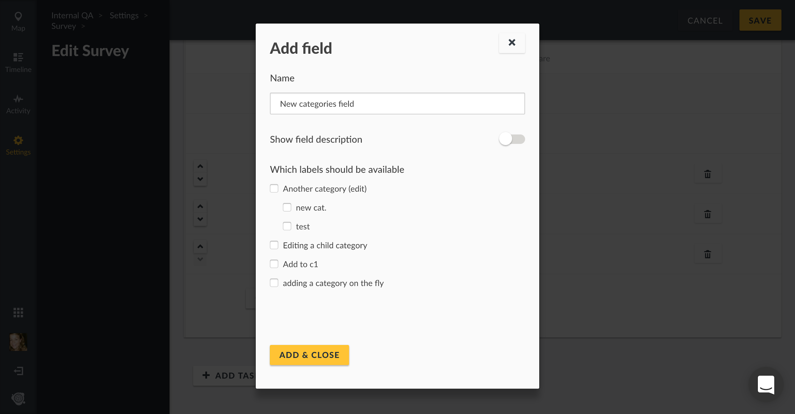

## 3.5 Categories {#3-5-categories}

Categories are a way of grouping your posts based on their content within a Survey.

To access the Categories configuration page,

* On the left hand menu bar, click on _**Settings**_

* Then, click on _**Categories**_.

* You’ll be redirected to a page where you can manage categories on your deployment

### 3.5.1 Adding and Configuring Categories {#3-5-1-adding-and-configuring-categories}

Unlike Ushahidi v2.x, your deployment DOES NOT come with pre installed/set-up categories. You will need to create this on your new Ushahidi deployment. Categories are now treated as custom fields within a Survey. This gives you the flexibility to add certain categories to some surveys, but not others.

There are two ways to create new categories. First, navigate to _**Settings → Categories**_

* Click on the _**Add Category icon as shown below**_

* Add the following details

  * _**Category Name:**_** **Give your category a name that will appear on your homepage and when users are creating new posts.
  * _**Description:**_** **You can provide a brief description of what kind of information you will fall under this category
  * _**Roles**_: You can opt to set your category as visible to specific user roles on your deployment here. This list is populated based on custom roles created. More on [Roles here](/4_managing_people_on_your_deployment/41_roles.md). 
  * _**Child / parent settings**_: You can choose to set any category as a “child” to another, creating a hierarchy within the categories themselves, and will reflect this in their positioning on the sidebar.

* Click on _**Save**_ to create the category. You can now choose to add this category to any of your Surveys.

You can also create categories on the fly within the survey form itself

* Navigate to a Survey form that already has a categories field
* Under the categories field, you will see an option to _**Add new category**_. Click this.

* Type the name of the new category you’d like to add

* Click the yellow check mark to save your new category, or click the trash can icon to cancel the new category creation

* To edit or manage your category and its settings, navigate to **Settings → Categories**

Add categories as custom fields as you build and edit Surveys. First, navigate to **Settings → Surveys,** and either select the already existing Survey you’d like to edit, or create a new Survey.

* Click on _**Add field**_ at the bottom of the survey builder and select \_**Categories **\_from the list of field options 
* Configure the following:
  * _**Name:**_** **Name or prompt for your survey field
  * _**Show field description:**_** **Turn this on if you’d like to add a short description or help text to the field
  * _**Which labels should be available:**_** **Select which categories you’d like to add to the field as options

* Click _**Add & Close**_** **to save your new categories field
* It will now appear as a custom field with the appropriate categories on your Survey form

The categories you selected will also appear in the left side context modal as filtering options

### 3.5.2 Editing Categories {#3-5-2-editing-categories}

To edit a category,

* Click on the desired category from the category list page

* You’ll get redirected to the _**Edit Category**_ page, where you should be able to add/edit details as described in the [adding categories section](#3-5-1-adding-and-configuring-categories) above.

* When done, click on _**Save**_, and your changes will reflect shortly.

### 3.5.3 Deleting Categories {#3-5-3-deleting-categories}

You can delete one or multiple categories at a time.

To delete a category,

* From the category list page,
  * To delete a single category, select the trash icon adjacent to the category
  * To delete multiple categories,
    * Tick the checkbox on the left, adjacent to the category/categories you would like to delete from the category list page
    * This action will activate the previously inactive _**Delete**_ button on top left hand corner of the page. Click on this button to initiate deletion.
* From the category edit page,

  * Click on the _**Delete Category**_ button

* A pop up box will appear on the top of the page, prompting you to confirm whether you would like to delete the category/categories

  * Click on _**Delete**_ to delete your category/categories
  * If you’d like to cancel the category deletion process, click on _**Cancel**_

