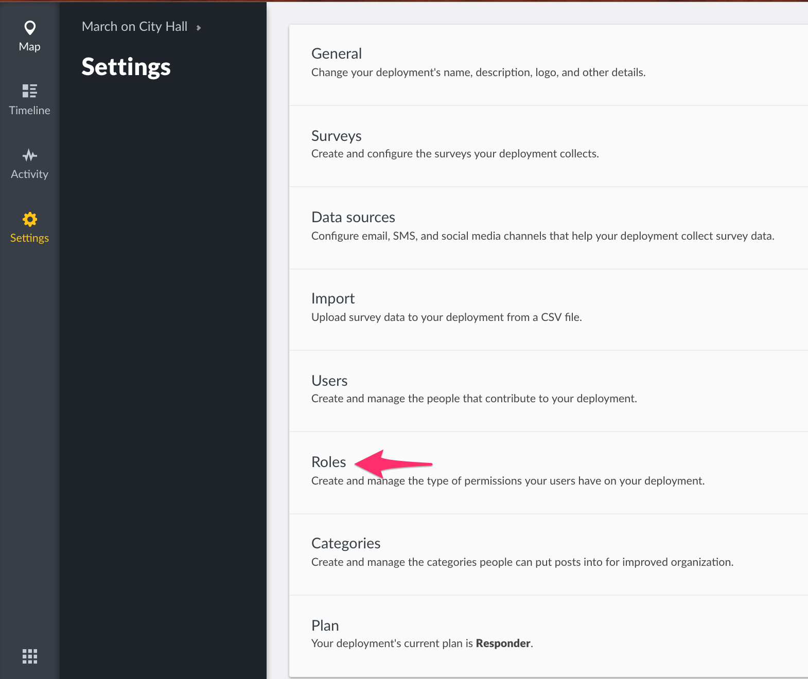

## 4.1 Roles {#4-1-roles}

This feature allows you to set up and manage default and custom roles and permissions for different user groups on your deployment. Each deployment has a **default “Admin” role**, which cannot be deleted, but can be edited. This **default “Admin” role** allows for full control over ALL functionality on your deployment.

To access the roles management page,

*   On the left hand menu bar, click on **_Settings_**

*   Then, click on **_Roles_**

*   You’ll be redirected to a page with a list of all existing roles - default &amp; custom roles (created by admins if any exist).

### 4.1.1 Add Role {#4-1-1-add-role}

To add a custom user role,

*   Click on the yellow **_Add icon_**
*   Add the following details
    *   **_Name_**: Provide a name for this new custom role
    *   **_Description_**: Provide a brief description of what/who this custom role has been created for
    *   **_Set your permissions_**. Below is a brief breakdown of what permissions get granted to users on selecting the options provided.
        *   **_Manage Users_**: Allows for
            *   Viewing Users
            *   Adding, Editing, Deleting Users
            *   and Changing roles for Users
        *   **_Manage Posts_:** Allows for
            *   Viewing posts
            *   Editing and Deleting Posts
            *   Publishing posts (Setting specific audiences to view )
            *   Adding posts to collections
            *   Creating new collections
        *   **_Manage Settings_:** Allows for managing
            *   General Settings
            *   Map Settings
            *   Data Sources
            *   Surveys
            *   Categories
        *   **_Bulk Data import_:** Allows for upload of data via CSV files
*   Click on **_Save_**.

_See the illustration below_

### 4.1.2 Edit Role {#4-1-2-edit-role}

To edit a role

*   Click on a role from the list provided to you.
*   On redirection to the edit page, make your desired changes to the role (i.e fill out details as directed in the****[**_Add Role_**](#4-1-1-add-role) section)
*   Click on **_Save_** to update the role.

### 4.1.3 Delete Role {#4-1-3-delete-role}

To delete a role

*   Click on a role from the Roles management list page
*   Then, click on the **_Delete This Role_** button at the bottom of the page

*   A black pop up box will appear on the top of the page, prompting you to confirm whether you would like to delete the custom role. If
    *   You would like to proceed with deletion, click on **_OK_**.
    *   You would not like to proceed with deletion, click on **_Dismiss_**