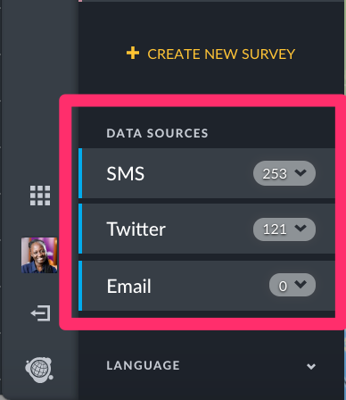
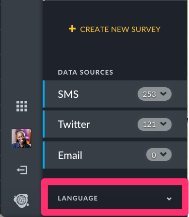
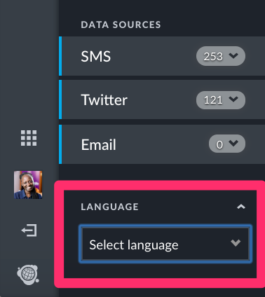
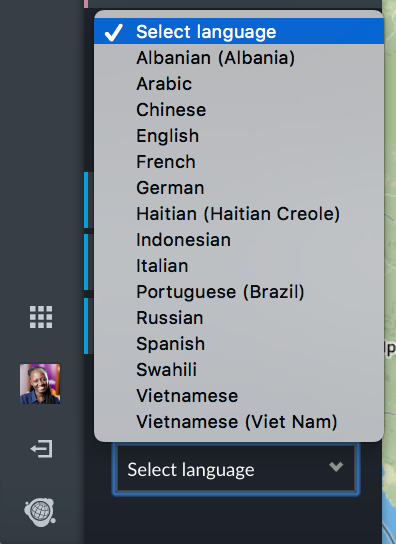

# 5.1 Map Mode

This mode displays all published posts on a map.

* Each post appears as an icon on the map. In the event that you opted to combine nearby posts on your Map settings page \([Section 3.2](../3.-configuring-your-deployment/3.2-general-settings.md) of this manual\), posts adjacent to each other on the map will cluster together, displaying a number denoting number of posts combined.
* Clicking on each individual post displays a small pop up box with the _**post title**_ and _**description.**_
* You should also be able to zoom in and out of the map as desired.

See below for an example from the Uchaguzi deployment

You also get a breakdown of incoming posts by source, as shown below.  
Visitors to your ushahidi instance can also select the language they'd like to interact with your data in. The language list consists of languages that have been translated upto 80%.

