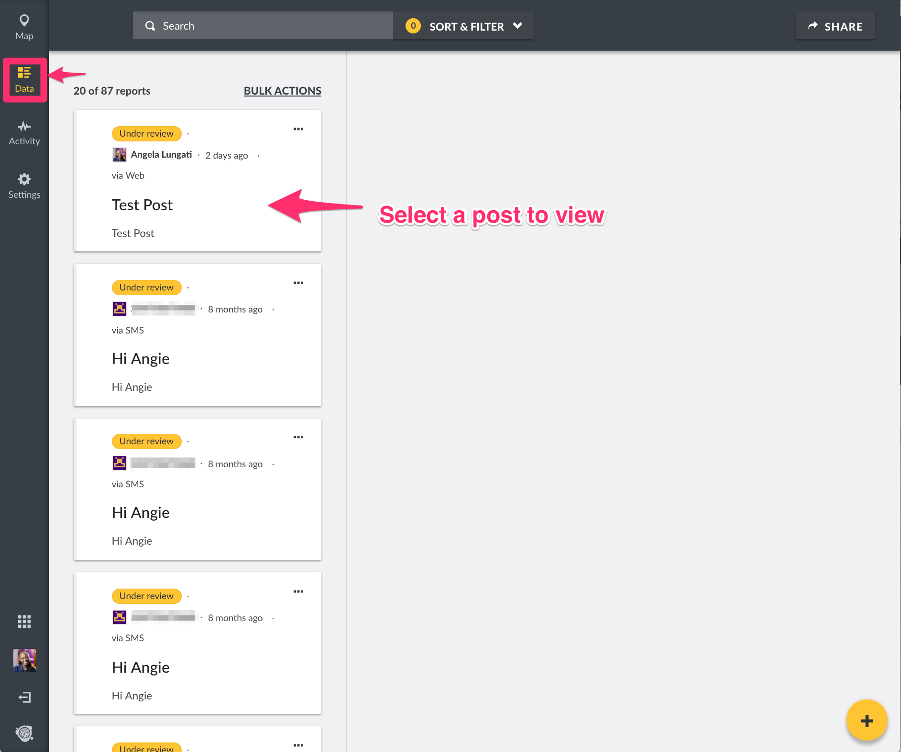
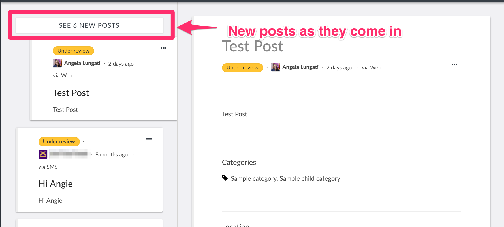
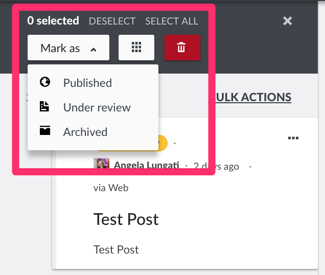

# 5.2 Data Mode

This mode allows you to view, triage, and manage posts coming into your deployment as a chronological list of events over time. It provides a split pane that allows for viewing post summaries on the left pane, and post details and editing in the right.

From here, you should be able to:-

* Add new posts
* View individual post details
* Edit posts to either change existing structures or assign posts from Twitter, SMS and/or email to a survey
* You can also
  * Add posts to collections
  * Publish posts
  * Put posts under review
  * Archive posts
  * Share posts
  * Delete posts
* Get notified when new posts arrive
* Perform bulk actions\( publishing, putting under review, archiving, adding to collections and deleting\) on multiple posts at a time

_NB: Data displayed on this page is dependent on permissions granted to the user viewing this page_

