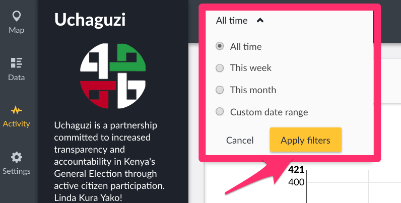
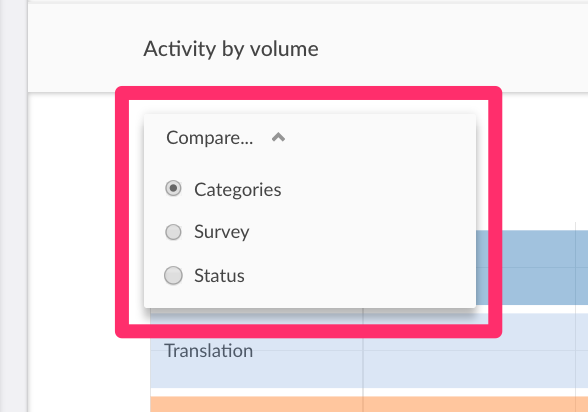

# 5.3 Activity Mode

This mode gives you a summary of how people are interacting with your deployment over time.

You can compare

* _**Activity over time**_

You can filter post count in a line chart over time by:-

* _**All posts**_
* _**Categories**_ that the posts belong to
* _**Surveys**_ that the posts were submitted to
* _**Status**_ i.e whether they’re published or not

You can opt to view your post counts on the graph as cumulative totals.

* _**Activity by Volume**_

You can filter post count in a bar chart over time by:-

* _**Categories**_ that the posts belong to
* _**Surveys**_ that the posts were submitted to
* _**Status**_ i.e whether they’re published or not

