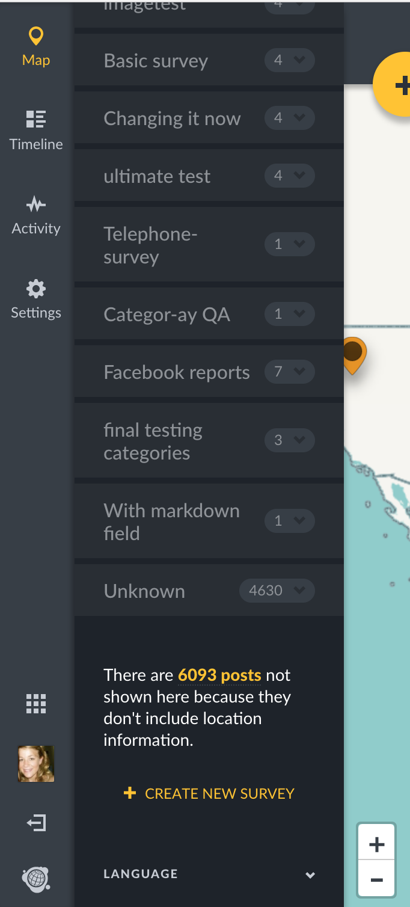

## 5.1 Map Mode {#6-1-map-mode}

This mode displays all published posts on a map.

* Each post appears as an icon on the map. In the event that you opted to combine nearby posts on your Map settings page \([Section 3.2](/3_configuring_your_deployment/32_general_settings.md) of this manual\), posts adjacent to each other on the map will cluster together, displaying a number denoting number of posts combined.
* Clicking on each individual post displays a small pop up box with the _**post title**_ and _**description.**_
* You should also be able to zoom in and out of the map as desired.
* If there are posts without location data, or _**Unmapped posts,**_** **you can see the number of unmapped posts below the list of surveys on the left side context modal. Clicking on this number will take you to a list of the Unmapped posts.

