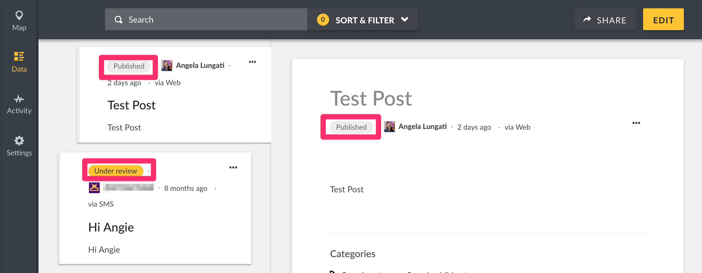
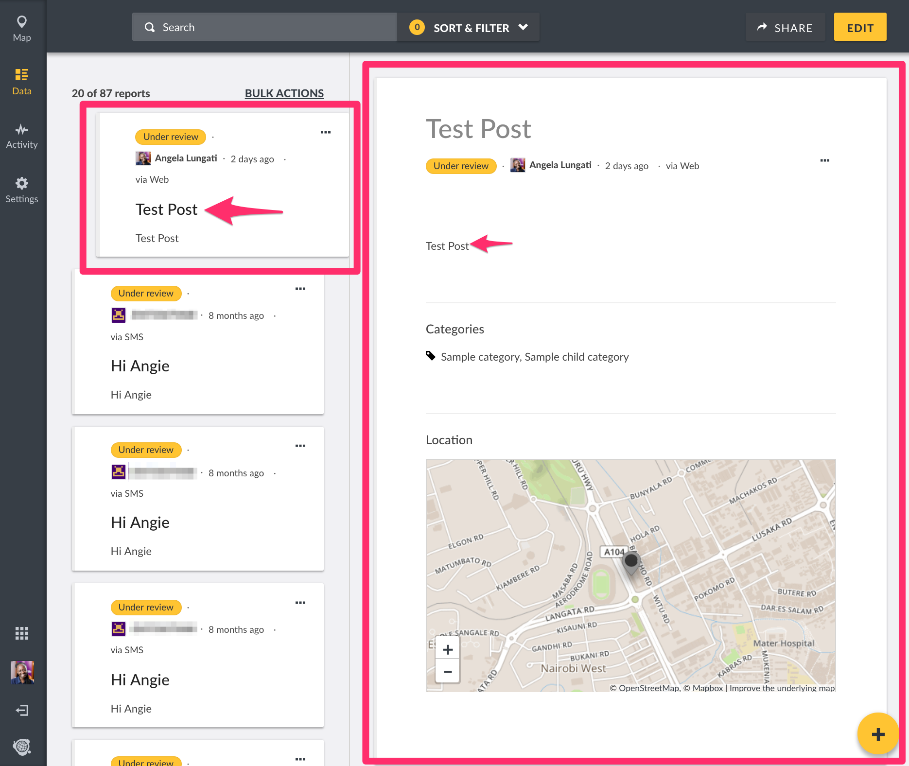

# 6.1 Viewing Posts

Posts on your deployment can be categorised into two types of data:-

* _**Structured**_**:** Incoming posts from the web platform and smartphone applications are classified as structured posts, since they adhere to the structure of surveys created on your deployment.
* _**Unstructured/Unknown**_**:** Incoming messages from SMS, Twitter and Email are classified as unknown posts, since they do not adhere to the structure of surveys created on your deployment. This means that these messages come in their raw form, and have to be manually structured by admins/anyone with permissions to edit posts, to fit into the structure of your survey. E.g an SMS message “Hello, my name is Angela” will need to be broken down into a title, a description, properly categorised etc.

You can view posts in either Map, Data or Activity mode. We'd previously discussed each of these modes separately in [Chapter 5](../5.-modes-for-visualizing-and-managing-data-on-your-deployment/).

For purposes of managing your data, we recommend using Data Mode. From this page, You should be able to see the following:-

* A list of all posts in chronological order of when they were submitted into the platform. You can opt to change the order of the posts either through options provided in the search filter \( we'll dive into filtering posts in the next section \)
* **Post visibility Status:** You can tell if a post is public or only visible to a specific audience

**Post source** \(is it from the Web, SMS, Email or Twitter?\).

* _**Structured posts**_ via web/smartphones will have their respective source label on them.
* _**Unstructured posts**_ will have a label denoting their source, as seen below with this sample SMS message
* **When the post was submitted:** Hovering over the timestamp of the post will give additional details on specific timing as shown below.
* Individual _**Post descriptions** on the left pane_**, and post details** \_on selection of a post card on the right pane
  * When viewing post details on the right pane, you'll be able to see additional details such as location, categories, and tasks. 
* If you’re an admin/your user role permits, you’ll should also be able to see the Edit button on the top right hand corner of your page_**NB: Locked posts - The platform allows for post locking, to avoid duplication of efforts. If someone on your team is currently editing a post, it is locked and made unavailable for you to edit. In this case, the edit button will not be visible to you, despite having adequate permissions. We'll dive deeper into post locking in**_ [_**section 6.4.2**_](6.4-editing-posts.md) _**of this manual.**_
* Every post has a three dotted icon as shown below. Depending on what permissions are granted to the person viewing, this button allows you to
  * **Add your post to a collection** \(_public_\)
  * **Share this post** \(_public_\) via facebook, twitter, embed on another website or export it to a CSV file.
  * **Edit your post** \(_limited by role_\)
  * **Publish your post** \(_limited by role_\)
  * **Put your post under review**, setting visibility to only members of your team \(limited by role\)
  * **Archive your post** \(_limited by role_\)
  * **Delete your post** \(_limited by role_\)
* A _**search filter**_ ****that allows you to
  * sort posts by
    * Date of creation
    * Post date i.e date when it was assigned to a survey
    * Date updated
* * filter reports by _**Saved searches, Status,**_ **Surveys, Categories, Data source, Date range, Location** or any other user determined parameters. [More on filters in section 6.2](6.2-filtering-posts.md)

_Please note that information displayed to users on each of these pages is dependent on permissions granted to registered/non registered users by the deployment administrator e.g_ ****_**Published posts**,_ _**Unknown posts**_ ****_and_ _**My posts,**_ ****and menu bars allowing for editing and deletion _are only visible to logged in users with necessary granted permissions\( See more on Roles in_ [_Section 4.1_](../4.-managing-people-on-your-deployment/4.1-roles.md) _of this manual\)_

