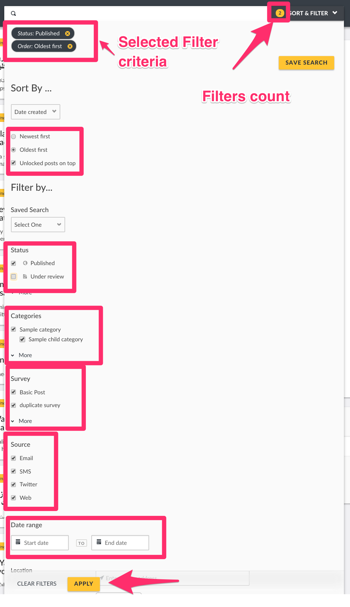

# 6.2 Filtering Posts

Filters can be applied to narrow down a large amount of data. You can filter posts by many types of parameters, for example: _**Surveys, Categories, Status, Date Ranges, and Location.**_

Survey and Category filters are located on the left side context modal of your deployment.

All other filters\(including survey and category\) are located within the "Filters" modal on the top global search bar, which allows you to

* **sort posts by**
  * Date of creation
  * Post date i.e date when it was assigned to a survey
  * Date updated
* **filter reports by**

  * _**Saved searches**_
    * By default, every deployment has a set of three featured Saved Searches\(read more in the [Saved searches section](../7.-analysing-data-on-your-deployment/7.1-saved-searches.md) of this manual\) from which you can view posts on your deployment, from the search filter.These include:-
      * _**Published Posts**_: Lists all posts that have been made public on your deployment\(i.e can be viewed by registered/non registered users on your deployment.
      * _**Unknown Posts**_: Lists all messages received from SMS, Email and Twitter, that have not been assigned to a survey i.e are unstructured
      * _**My posts**_: Lists all posts created by you as a user
  * _**Status**_
    * Published: Posts that can be seen by both logged in and non logged in users
    * Under review: Posts that can only be seen by logged in users with adequate permissions
    * Archived: Posts that have been deemed to be irrelevant and removed from your active view
  * Other filters include **Surveys, Categories, Data source, Date range, Location** or any other user determined parameters

  Filters are additive, so you can apply as many as you would like. This search filter is available on all pages.

