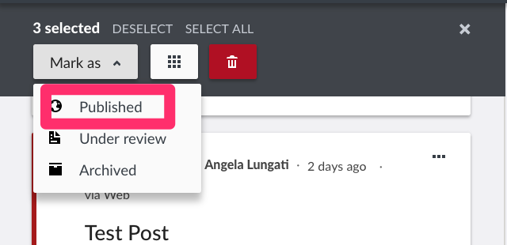

# 6.5 Publishing Posts

The ability to publish posts is only available to admins or registered users with adequate permissions. This means that non registered users cannot publish posts. Posts submitted by non registered users have to be moderated.

To publish a post, simply change the status to Published as shown below:

* From the data view page, either 
  * Individually or
  * in Bulk
* From the post detail view
* While editing a post

Then, click on _**Save**_.

