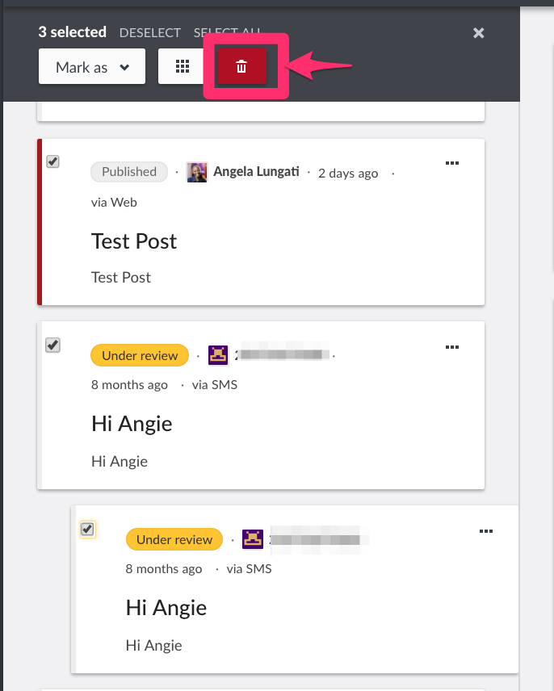

# 6.6 Deleting Posts

The ability to delete posts is only available to admins or registered users with adequate permissions. This means that non registered users cannot delete posts.

You can select multiple posts to delete at a time from the post list page, or delete individual posts from the list page, or individual post view page .

To delete

* An individual post from the data view, click on the three dotted icon from the list of detail pane as shown below, then click on _**Delete**_
  * A pop up box will appear on the top of the page, prompting you to confirm whether you would like to delete your post
    * Click on _**Delete**_ to delete your post
    * If you’d like to cancel the post deletion process, click on _**Cancel**_
* Multiple posts from the post lists page
  * Click on bulk actions, then tick the checkbox on the left, adjacent to the post\(s\) you would like to delete from the posts list page. You can also click on _**Select All**_ to grab all posts listed on that page
* * This action will activate the previously inactive _**Delete**_ button on the grey menu bar. Click on it to initiate the deletion process
  * A black pop up box will appear on the top of the page, prompting you to confirm whether you would like to delete your post\(s\)
    * Click on _**Delete**_ to delete your post\(s\)
    * If you’d like to cancel the post deletion process, click on _**Cancel**_

