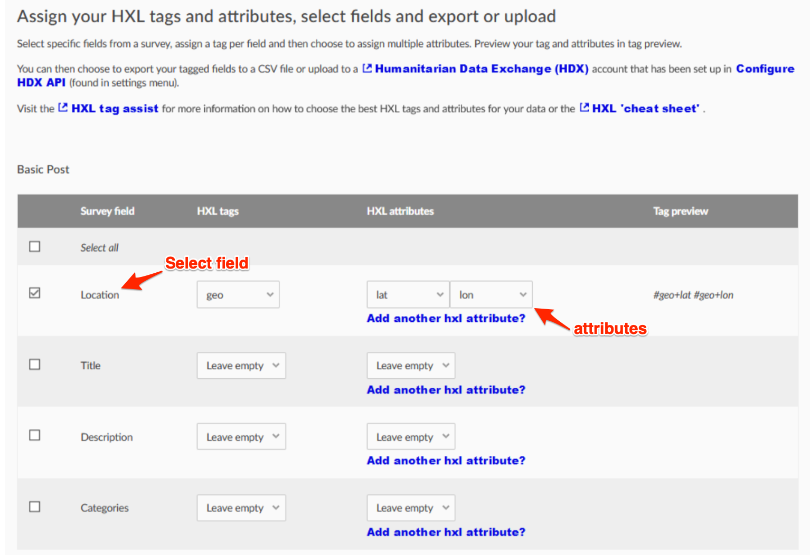
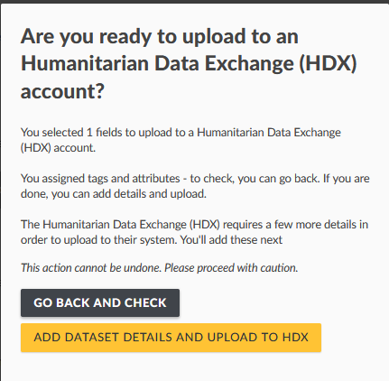

# 6.9 HDX integration


The work done in the COMRADES project has received support from the European Union’s Horizon 2020 research and innovation programme under [grant agreement No 687847](http://cordis.europa.eu/project/rcn/198819_en.html). This new addition to Ushahidi Platform V3+ was possible thanks to the COMRADES project partners and funders.


## What is HDX?

[HDX ](https://humdata.org)is an open platform for sharing data across crises and organisations. Its goal is to make humanitarian data easy to find and use for analysis. HDX is managed by the United Nations Office for the Coordination of Humanitarian Affairs \(OCHA\) and is located in The Hague. OCHA is part of the United Nations Secretariat and is responsible for bringing together humanitarian actors to ensure a coherent response to emergencies. 

HXL is a lightweight, data tagging standard that allows for data to be quickly harmonised, concatenated, and compared. The standard was developed by representatives from the Humanitarian Innovation Fund, IOM, OCHA, Save the Children, IFRC, UNHCR, UNICEF, USAID, the World Bank, and the World Food Program.

The COMRADES platform has integrated with the United Nations’ ​Humanitarian Data Exchange\(HDX\)​ and supports the associated ​Humanitarian Exchange Language \(HXL\)​. This integration ensures that COMRADES and now Ushahidi Platform V3+ users can export data sets in an acknowledged humanitarian data standard, to a secure and recognized humanitarian data sharing exchange that is in use by over 200 of the world’s most important humanitarian organisations. Users with both a Ushahidi Platform v3+ deployment and an HDX account can export data from their deployment into their HDX account. 

The export can be appropriately tagged with HXL to allow the data to work with HDX’s suite of online tools including “quick charts” functionality. Building this functionality ensures that users’ data are stored securely even if the deployment is discontinued and is easily discoverable by a significant portion of the humanitarian community.

## How to use exports and HDX

Ushahidi Platform V3+ has multiple ways to export data. You can choose to export data as a plain CSV file, download a CSV export file that includes a row for HXL tags and attributes, or export directly into the HDX platform. The following section explains the different options for exporting data and how to use them

### HDX Upload and Exports

#### Configure HDX API Screen

Before starting a HDX upload, you need to configure the HDX User Id and API Key.

* On the left hand menu bar, click on _**Settings**_
* Then, click on _**Configure HDX API**_ or in the link that appears while trying to start a HDX export for the first time. 
* Enter you _**user id**_\(maintainer id\) for HDX and your HDX _**API key**_.

This information is saved and used for each specific user when uploading to HDX, instead of being deployment-wide settings.

#### Exporting data to HDX

* Go to _**Settings**_
* Click on _**Export and tag data,**_ then _**export.**_

* Click on _**Assign tags and attributes**_ to assign HXL tags and send data to HDX. This button will take you to a screen where you can configure and start an HDX export. You will see a screen where you can configure the HXL attribute mappings to your data fields. 
* Select the fields to be included and what HXL attributes and tags they map to. For a field to be included in the export, it has to be selected in the checkboxes to the left of each field. You can also click “Select All” for each survey if you want all its fields to be added.

After you are done selecting the fields you want to add to your HDX export, you have the option to export it as a regular file \(this will generate a CSV with HXL tags, and behaves like the regular export\) or to upload it to an HDX account by

* Clicking on the _**UPLOAD TO HDX ACCOUNT**_ button to continue.

You will see a warning to verify your content before you continue, and you can either check again or continue the process.

* Once you are sure, click on _**ADD DATASET DETAILS AND UPLOAD TO HDX**_  to continue. 

You will see the HDX configuration screen where you can select the options that will be applied when your dataset is uploaded to your HDX account.

* **Private/Public:** You need to select whether you want your data to be private, where only you and any other HDX members of your organisation can search, edit or download, or public where anyone can edit, search or download
* **Title of the data set:** Enter the title of the data set. This will be the title that will appear on humdata.org
* **Source:** The source by default is your deployment name. This helps the  [humdata.org](http://humdata.org/) people to know how the dataset is called and where it came from.
* **Select your organisation:** The organisations available in the Organisation list are all the organisations your HDX account has access to. You may not be part of any organisation, in which case you may request to join one in the[ **humdata.org**](https://data.humdata.org/) website or create your own through their registration process for organisations. 
* **License:** Select the license for your organisation.
* When you are happy with the configuration, click on _**SUBMIT TO HDX ACCOUNT**_. 

You will see a notification that the export is being prepared, and can leave the page and continue working while it is being generated. You will be notified once the upload is ready.

Once the HDX upload finishes, you can see the exported data in your HDX account by logging in and going to the “My datasets” page in HDX ​[https://data.humdata.org/dashboard/datasets](https://data.humdata.org/dashboard/datasets) if you want to see the details of your dataset, you can click on the blue link that has the name of your dataset.

