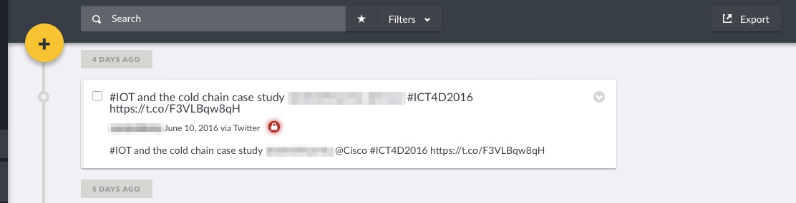

## 6.1 Viewing Posts {#5-1-viewing-posts}

Posts on your deployment can be categorised into two types of data:-

* _**Structured**_**:** Incoming posts from the web platform and smartphone applications are classified as structured posts, since they adhere to the structure of surveys created on your deployment.
* _**Unstructured/Unknown**_**:** Incoming messages from SMS, Twitter and Email are classified as unknown posts, since they do not adhere to the structure of surveys created on your deployment. This means that these messages come in their raw form, and have to be manually structured by admins/anyone with permissions to edit posts, to fit into the structure of your survey. E.g an SMS message “Hello, my name is Angela” will need to be broken down into a title, a description, properly categorised etc.

By default, every deployment has a set of three featured Saved Searches\(read more in the [Saved searches section](/7_analysing_data_on_your_deployment/72_saved_searches.md) of this manual\) from which you can view posts on your deployment, from the search filter.

These include:-

* _**Published Posts**_: Lists all posts that have been made public on your deployment\(i.e can be viewed by registered/non registered users on your deployment.
* _**Unknown Posts**_: Lists all messages received from SMS, Email and Twitter, that have not been assigned to a survey i.e are unstructured
* _**My posts**_: Lists all posts created by you as a user

You can view posts in either Map, Data or Activity mode. We'd previously discussed each of these modes separately in [Chapter 5](/5_modes_for_visualizing_and_managing_data_on_your_/README.md).

For purposes of managing your data, we recommend using Data Mode. From this page, You should be able to see the following:-

* A list of all posts in chronological order of when they were submitted into the platform. You can opt to change the order of the posts either through options provided in the search filter \( we'll dive into filtering posts in the next section \)
* **Post visibility Status:** You can tell if a post is public or only visible to a specific audience
* **Post source** \(is it from the Web, SMS, Email or Twitter?\).
  * _**Structured posts**_ via web/smartphones will have their respective source label on them.
  * _**Unstructured posts**_ will have a label denoting their source, as seen below with this sample SMS message

* _**Date and time**_ the post was submitted
* _**Post description**_
* If you’re an admin/your user role permits, you’ll should also see a pen icon on the right hand corner of every post.

* All visitors/users should also see a three dotted line on the right hand corner of the post that presents them with options to:

_○ Add your post to a collection_

* _○ Share your post._ You can share your post via facebook or twitter. You can also embed the post on another website, or export this post to CSV
* ○ If you’re an admin/your user role permits, you’ll see the following additional options:-
* ■ Publish
* ■ Put under review
* ■ Archive
* ■ Delete
* A _**search filter**_** **that allows you to filter reports by surveys, categories, who posts are visible to, date range, location, or user determined parameters

You can view individual report details by clicking on the Post Title link, which will redirect you to a page with additional details on categories, tasks completed/not completed for this post.

You can also opt to do the following from the individual report page.

* Edit the post
* Add the post to a collection
* Share your post
* Publish your post
* Put your post under review
* Archive your post
* Delete the post

_Please note that information displayed to users on each of these pages is dependent on permissions granted to registered/non registered users by the deployment administrator e.g_** **_**Published posts**,_ _**Unknown posts**_** **_and_ _**My posts,**_** **and menu bars allowing for editing and deletion _are only visible to logged in users with necessary granted permissions\( See more on Roles in_ [_Section 4.1_](../4_managing_people_on_your_deployment/41_roles.md) _of this manual\)_

