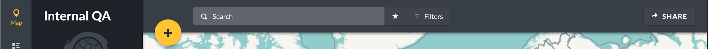
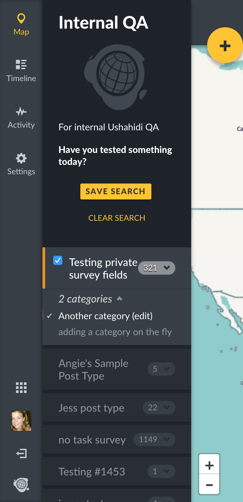
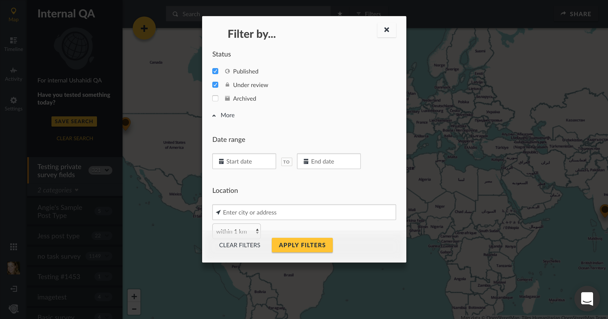

## 6.2 Filtering posts {#7-1-filters}

Filters can be applied to narrow down a large amount of data. You can filter posts by many types of parameters, for example: _**Surveys, Categories, Status, Date Ranges, and Location.**_

Survey and Category filters are located on the left side context modal of your deployment.

All other filters are located within the "Filters" modal on the top global search bar.

Filters are additive, so you can apply as many as you would like. This search filter is available on all pages.

