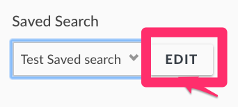
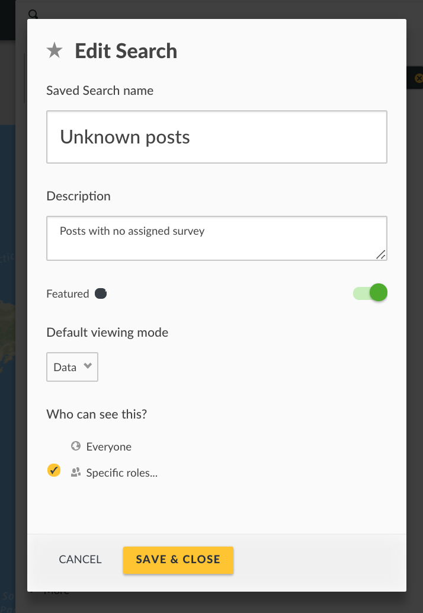
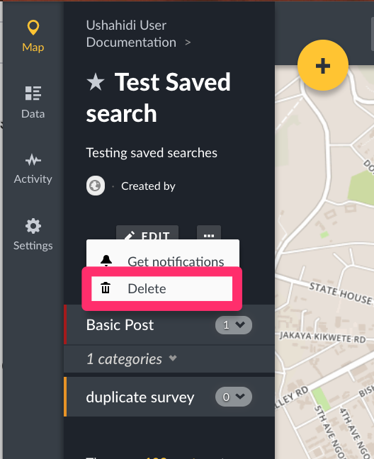

# 7.1 Saved Searches

Saved searches are dynamic groupings of posts that match parameters chosen in filters.They are dynamic because as new posts are added that fit the search criteria, they will show in the saved search automatically, and without manual intervention.

Saved searches are particularly useful for managing workflows and teams on your deployment. They allow you to set filters for information that’s relevant to each working group/team. For example:-

● It is useful for a team tasked with structuring to only see posts that are unstructured. Creating a saved search with these parameters will be useful

● A team tasked with publishing needs to only see posts that are yet to be published, so creating a saved search with these parameters will be useful.

_**Please note that only registered users can create Saved searches. Non registered users can only view public searches**_

## 7.1.1 Creating a saved search {#7-2-1-creating-a-saved-search}

You can create a saved search from your homepage by:-

* Adding your search/filter parameters on the search bar as shown below.
  * A _**Save Search**_ button will appear on the search and filter modal.Click on it. 
* A small pop up box will appear, asking you to fill in the following details:-
* * Assign a _**saved search name**_
  * Provide a _**description**_
  * Set the **audience** allowed to see this saved search
  * Set the **default viewing mode** for this saved search\(choosing between Map, Data or Activity\). This is the view that a user will see when they first arrive at this saved search
  * Determine if this saved search is **featured** or not. Setting this saved search as featured displays to all users on the saved search menu
* Click on _**Save&Close**_ when done.
* Your saved search should now appear on the _**Saved Searches**_ ****menu bar on your search bar.

## 7.1.2 Updating a saved search {#7-2-2-updating-a-saved-search}

You can update a saved search at any time by adding/editing your filters/keywords, or turning off existing filters/keywords.

* Set your parameters on the search bar by either typing or selecting options from the search
* An _**Update Search**_ button will appear on the menu bar on the left of your screen. Click on it.

## 7.1.3 Adding a notification to a saved search {#7-2-3-adding-a-notification-to-a-saved-search}

As a registered and logged in user, you can set up notifications on Saved Searches. This means that any time a post is added to a saved search, you will receive an email or phone notification.

To add a notification,

* Select saved search you’d like to receive notifications for
* Click on the three dots button, right next to the _**Edit**_ button.
* Click on _**Get Notifications**_
* You can turn off notifications for this saved search using the same process described above.

## 7.1.4 Editing a saved search {#7-2-4-editing-a-saved-search}

To edit a saved search,

* Select saved search you would like to edit from the search filter.
* Click on _**Edit**_ ****as shown below
* Edit your saved search details, then click on ****_**Save&Close**_

## 7.1.5 Deleting a saved search {#7-2-5-deleting-a-saved-search}

To delete a saved search,

* Select saved search you would like to delete
* Click on the three dots button, right next to the _**Edit**_ button.
* Click on ****_**Delete**_. A pop up box will appear on the top of the page, prompting you to confirm whether you would like to delete your saved search
* * Click on _**OK**_ to delete your saved search
  * If you’d like to cancel the saved search deletion process, click on _**Cancel**_

