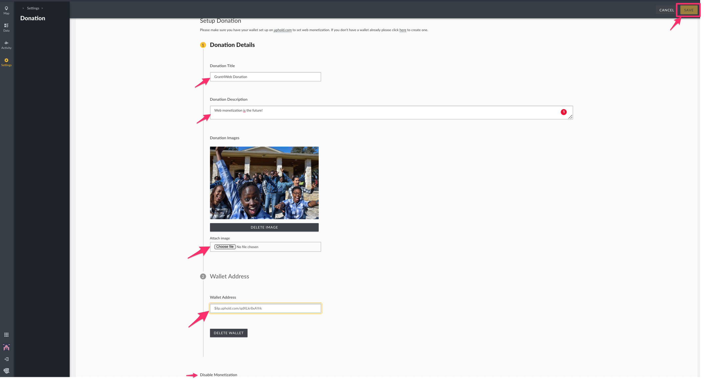

# 7.1 Donations

### **7.1.1 Configuring your deployment**

* Go to your settings page on your Ushahidi deployment.
* Click on Donation.

###  **7.1.2 How to set up your wallet with Uphold**

You can access the uphold site through your deployment by clicking on the link at the top of your donation page if you would like to edit your wallet or create a new one.


**You must have an account with a wallet that supports the Interledger Protocol \(ILP\) to enable Web Monetization on your site**


_**N.b: At the time of this writing, the wallet provider we recommend using is Uphold**_

* **Go to** [**https://wallet.uphold.com/signup**](https://wallet.uphold.com/signup)
* **You can create an account as an individual or as an organization**

#### **As an individual** 

* Click on the individual tab
* Enter your email address, password, and the country you reside in.

* Accept the terms and conditions and click on _**Next**_
* You will get an email to verify your email address.

* Once you sign up, you will be redirected to the page below. Add more details to create your uphold account.

* Click _**Next**_ when done.

*  Click on _**let’s do this**_

* You will be redirected to your account’s dashboard. 

Once you have an ILP-enabled wallet, to receive donations based on the traffic on your instance, you will need to set up your Ushahidi deployment. 

* **Enter the following donation details.**
  * _**Donation Title**_: This is the title of your donation that the public will see once you enable web monetization in your deployment
  * _**Donation Description**_: Provide a brief description of why you need support for your project 
  * _**Donation image**_: Choose an image for your donation campaign
* **To get your wallet address \(if you set it up in Uphold\);**
  * Log into your uphold account. You will be redirected to your dashboard [https://wallet.uphold.com/dashboard](https://wallet.uphold.com/dashboard)
  * On the right side of your dashboard, click on the drop-down arrow on the “_**From**_” field on the transact section.

* A module will appear with different transactional choices, scroll down and select inteleger network to get your wallet address.

* Select the checkbox for verification purposes and click “_**confirm**_”, an inteleger pointer module will appear, copy the wallet address indicated as ‘inteleger payment pointer’.

   ****  
****

* Once you have copied the address, go back to your deployment and paste the address on the wallet address field as shown above.
* Click _**save**_.

Reload your page and a donate button will appear at the top right corner of your deployment on the ****map view. This indicates that your deployment is monetizing and your sponsors can donate by clicking on the link that will redirect them to a user guide on how they can donate to your deployment.

### **7.1.3 How to support deployments with donations**

Ushahidi deployers may now enable web monetization in their deployments. Web monetization is a way of supporting the websites that you love without playing the advertisers’ game. All you need is to get your browser set up and directly support the deployment of your choice.  
**There are two types of users;**

### **7.1.3.1 Donor with a Coil account**

When a user with a logged-in Coil account visits the deployment page with web monetization enabled, they will see a counter notifying them of the donation.  To learn more about the donation title, description, image, and the amount donated, click on the more info blue icon represented as an \(i\)**.**

### 7.1.3.2 **Donor without a Coil account**

As a user without the Coil account, when visiting a deployment with the Web Monetization feature enabled, you will see a “_**donate**_” button at the top right corner of the screen.

* Click on the _**donate**_ button.

*  A pop-up window will appear with the;
  * Title of the donation
  * Brief description about the donation 
  * An Image
  * A direct link to our user guide on how you can donate.

### **7.1.4 How to set up a coil account**

* Go to [https://coil.com/signup](https://coil.com/signup)
* Enter your email address and password.
* Tick the checkbox to agree to the terms and conditions.
* Click on _**Next**_.

* A verification email will be sent to your email address with a verification code.

* Copy-paste the verification code or verify the email address from the email message sent.
* A pop-up window will appear. Enter the name on your credit card and the credit card information.
* Click on the activated “_**Star coil membership for $5/month**_” field and be redirected to your account Homepage.

* Click on **‘install coil extension.’**
* Select your preferred browser for the extension or puma browser app for your phone.

* The coil extension icon will appear on your browser.

* To see your donations, go back to the deployment, reload the page, and a counter will appear.
* For more information, click on the blue ‘more info’ icon\(i\).

