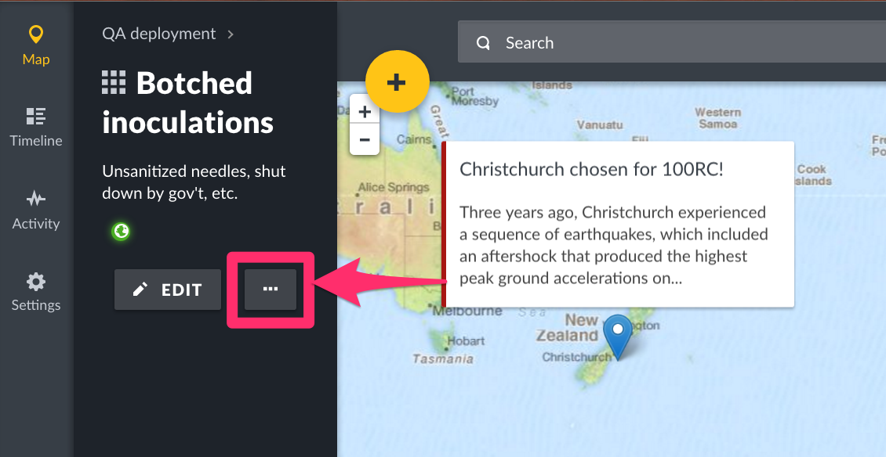

## 7.3 Collections {#7-3-collections}

A “Collection” is a manually-curated grouping of posts. It is not dynamic, meaning the posts within it do not change unless a you manually update them.

You may find collections useful in grouping posts that you would like to share with external partners . For example , you may find it useful to add allposts that require escalation to a collection and then export data in that collection in a CSV file that youcan share with partners.

Please note that only registered users can create Collections. Non registered users can only view featured public collections

### 7.3.1 Creating new collections {#7-3-1-creating-new-collections}

To create a new collection,

*   Click on by clicking on:-
    *   Collections icon on the bottom left hand corner of your deployment as illustrated below

*   *   The Posts List page on the menu adjacent to each post on the right( _note that this will assign this post to the new collection created_)

*   *   The individual Post view page( _note that this will assign this post to the new collection created_)

*   A pop up box will appear, with a list of all existing collections, and a **_Create collection_** button. Click on it.

*   Then, fill in the following details:-

*   *   Assign a **_Collection name_**
    *   Provide a **_description_**
    *   Set the **audience** allowed to see this collection
    *   Set the **default viewing mode** for this collection (choosing between Map, Activity, or Data). This is the view that a user will see when they first arrive at this collection
    *   Determine if this collection is **featured** or not. Setting this collection as featured displays to all users on the collections menu
*   Click on **_Save&amp;Close_ **when done.
*   Your collection should now appear on the left menu bar under **_Collections_**

### 7.3.2 Adding Posts to collections {#7-3-2-adding-posts-to-collections}

You can add a post to a collection from:-

*   The Posts List page on the menu adjacent to each post on the right

*   The individual Post view page

*   A pop up box will appear, with a list of all existing collections. Select the collection(s) you’d like to add the post to.

*   You can add a post to multiple collection, so tick all checkboxes that apply.
*   You can also create a new collection to add the post to from these two pages. Simply click on **_Create New_ **from within this dropdown as described in the [Creating new collections (section 7.3.1)](#7-3-1-creating-new-collections) of this manual

### 7.3.3 Adding notifications to collections {#7-3-3-adding-notifications-to-collections}

As a registered and logged in user, you can set up notifications on Collections. This means that any time a post is added to a collection, you will receive an email or phone notification.

To add a notification,

*   Click on the collection you’d like to receive notifications from.
*   Click on the three dots button, right next to the **_Edit_** button.

*   Click on **_Get Notifications_**

****

*   You can turn off notifications for this collection using the same process described above.

### 7.3.4 Editing Collections {#7-3-4-editing-collections}

To edit a Collection,

*   Click on the collection you would like to edit
*   Click on **_Edit_ **as shown below
*   Edit your Collection details, then click on** _Save&amp;Close_**

****

### 7.3.5 Deleting Collections {#7-3-5-deleting-collections}

To delete a collection,

*   Click on the collection you would like to delete
*   Click on the three dots button, right next to the **_Edit_** button.

*   Click on **_Delete_**
*   A black pop up box will appear on the top of the page, prompting you to confirm whether you would like to delete your collection

*   *   Click on **_OK_** to delete your collection
    *   If you’d like to cancel the collection deletion process, click on **_Cancel_**