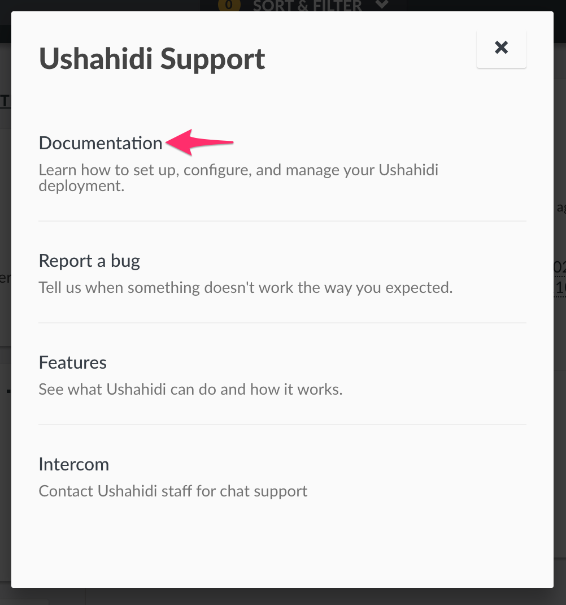

# 8. Additional Links

These additional links are available on the mode bar to the left of your deployment

Clicking on the Ushahidi logo icon displays a pop up as shown below.

## 8.1 Documentation 

This link redirects you to our website’s [support section](https://ushahidi.com/support) for access to documentation

## 8.2 Report a bug 

This link redirects you to our [github issues page to report a bu](https://github.com/ushahidi/platform/issues/new)[g](https://github.com/ushahidi/platform/issues/new)

## 8.3 Features 

This link redirects you to the [Ushahidi website’s feature breakdown page](http://ushahidi.com/features).

## 8.4 Intercom

This link opens our support channel.

